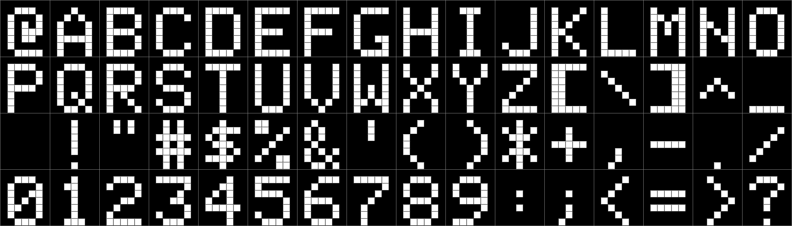

#Apple ]\[ HGR Font Tutorial

Revision: 30, Jan 12, 2016.

# Table of Contents

* Introduction
* Functions we want & will write
* Hard-Coded: A
* Quirks of the Apple HGR screen
 * Non-Linear Memory
 * No FONT data in ROM
 * HGR bytes are reversed
 * Half-pixel shift
* Font Data
 * Raw Font Data
 * Image to Font Data (Javascript)
* DrawChar()
 * Font -> Screen Memory Trace
 * DrawChar() version 1
 * X Cursor Position
 * CursorCol()
 * Introduction to Optimization
 * DrawChar() version 2
 * DrawChar() version 3
* Character Inspector
 * Character Inspector version 2
 * Character Inspector version 3
* Y Cursor Position
* Natural Params SetCursorColRow()
* DrawString()
* Recap
* Copy text screen to HGR
* Exercise 1: ScrollHgrUpLine()
* Exercise 2: ScrollHgrUpPixel()
* Conclusion
 * Solution 1: ScrollHgrUpLine()
 * Solution 2: ScrollHgrUpPixel()
* References
* Misc. Utilities and Files
* TODO:

# Introduction

A lot of people in comp.sys.apple2.programmer and other places on the internet have wondered how to "print" text onto the Apple's High Resolution Graphics (HGR) screen. Here's a tutorial on "6502 Font Blitting."

**Note**: We will prefix hex numbers with `$` (or C's notation of `0x`). We will prefix binary numbers with `%`.

Fire up your favorite Apple emulator (*cough* AppleWin) or real hardware.

If you use:

* [AppleWin](https://github.com/AppleWin/AppleWin) press `F2` (to reboot), `Ctrl-F2` to Ctrl-Reset, and then press `F9` until you get a Monochrome screen.

* [Jace](https://github.com/Michaelangel007/jace/blob/master/target/jace-2.0-SNAPSHOT-jar-with-dependencies.jar) press `Ctrl-Delete` to reset.

 * You will also need the Java JRE.

 * On OSX, Jace has an copy-paste bug and won't paste in the first line of the clipboard. :-/

* [Virtual II](http://www.virtualii.com/) press `Ctrl-F12` to reset.

There are other emulators written in Javascript but they are poor due to 2 reasons:

* Don't support paste -- you'll be forced to manually enter in the hex code. :-/  (Yeah, right!
* Don't emulate the half-pixel shift of real hardware at all -- not an issue, but you won't see the full effect for one section.

Some emulators that run in the browser:

* [Apple 2 js](https://www.scullinsteel.com/apple2/) make sure you select:

 * Options, [x] Green Screen

* [David's Caldwall's Apple 2 Javascript + WebGL](http://porkrind.org/a2/)


**Note**: If you are using an emulator -- I've added "comments" in the lines of machine code you would paste  by having a semi-colon and a description at the end of the line.  

 * **You may want to mute your sound** since the Apple will beep at the semi-colon "comments" as that part of the input is not tehcnically valid input.  (The rest of the line WILL be processed, though.)


## Functions we want & will write

When we are done we will have 6502 assembly code that implements the equivalent of these C functions names:

```c
    void DrawChar();
    void DrawCharCol( char c, int col );
    void DrawCharColRow( char c, int col, int row );
    void SetCursorRow( int row );
    void SetCursorColRow3( int col, int row );
    void SetCursorCol( int col );
    void IncCursorCol();
    void DrawHexByte( char c );
    void DrawString( char *text );
    void CopyTextToHGR();
    void ScrollHgrUpPixel();
```

## Hard-Coded: A

When you are at the Applesoft `]` prompt type (or paste) in the following:

(If you use AppleWin, select the lines, copy, switch back to the emulator, and press Shift-Insert to paste)

    HGR
    CALL-151
    2000:4
    2400:A
    2800:11
    2C00:11
    3000:1F
    3400:11
    3800:11

Voila!

You should see an uppercase A appear in the top left of the HGR screen.


Magic? :-)

Nah, just Computer Science. :-)

The first question you probably have is _"How did I know what bytes to use?"_  We'll get to that in a second.


## Quirks of the Apple HGR screen

There are couple of things we need to discuss first. The preceeding example showed that the Apple's HGR screen behaves a little "funky." The Apple's, shall we say, esoteric use of hardware, is one of the reasons us fans love (or hate) it.  "There are 4 lights!" Er, There are 4 things that stand out:


### Non-Linear Memory

First, we should notice that video memory is non-linear. :-( You'll want to get familiar with the HGR address for the various Y scanlines:

"Understanding the Apple II", page 5-14 has this table `HGR Memory-mapped IO`:

* https://archive.org/stream/understanding_the_apple_ii#page/n105/mode/2up

With all the decimal cruft removed:

<hr>

    Table 1: HGR Y Address for every scanline

| Y    |Address|   | Y   |Address|   | Y   |Address|   | Screen Hole  |
|-----:|:-----:|---|----:|-------|---|----:|:-----:|---|:------------:|
| **0**| $2000 | | **64**| $2028 | |**128**| $2050 | | $2078..$207F |
|   1  | $2400 | |   65  | $2428 | |  129  | $2450 | | $2478..$247F |
|   2  | $2800 | |   66  | $2828 | |  130  | $2850 | | $2878..$287F |
|   3  | $2C00 | |   67  | $2C28 | |  131  | $2C50 | | $2C78..$2C7F |
|   4  | $3000 | |   68  | $3028 | |  132  | $3050 | | $3078..$307F |
|   5  | $3400 | |   69  | $3428 | |  133  | $3450 | | $3478..$347F |
|   6  | $3800 | |   70  | $3828 | |  134  | $3850 | | $3878..$387F |
|   7  | $3C00 | |   71  | $3C28 | |  135  | $3C50 | | $3C78..$3C7F |
| **8**| $2080 | | **72**| $20A8 | |**136**| $20D0 | | $20F8..$20FF |
|   9  | $2480 | |   73  | $24A8 | |  137  | $24D0 | | $24F8..$24FF |
|  10  | $2880 | |   74  | $28A8 | |  138  | $28D0 | | $28F8..$28FF |
|  11  | $2C80 | |   75  | $2CA8 | |  139  | $2CD0 | | $2CF8..$2CFF |
|  12  | $3080 | |   76  | $30A8 | |  140  | $30D0 | | $30F8..$30FF |
|  13  | $3480 | |   77  | $34A8 | |  141  | $34D0 | | $34F8..$34FF |
|  14  | $3880 | |   78  | $38A8 | |  142  | $38D0 | | $38F8..$38FF |
|  15  | $3C80 | |   79  | $3CA8 | |  143  | $3CD0 | | $3CF8..$3CFF |
|**16**| $2100 | | **80**| $2128 | |**144**| $2150 | | $2178..$217F |
|  17  | $2500 | |   81  | $2528 | |  145  | $2550 | | $2578..$257F |
|  18  | $2900 | |   82  | $2928 | |  146  | $2950 | | $2978..$297F |
|  19  | $2D00 | |   83  | $2D28 | |  147  | $2D50 | | $2D78..$2D7F |
|  20  | $3100 | |   84  | $3128 | |  148  | $3150 | | $3178..$317F |
|  21  | $3500 | |   85  | $3528 | |  149  | $3550 | | $3578..$357F |
|  22  | $3900 | |   86  | $3928 | |  150  | $3950 | | $3978..$397F |
|  23  | $3D00 | |   87  | $3D28 | |  151  | $3D50 | | $3D78..$3D7F |
|**24**| $2180 | | **88**| $21A8 | |**152**| $21D0 | | $21F8..$21FF |
|  25  | $2580 | |   89  | $25A8 | |  153  | $25D0 | | $25F8..$25FF |
|  26  | $2980 | |   90  | $29A8 | |  154  | $29D0 | | $29F8..$29FF |
|  27  | $2D80 | |   91  | $2DA8 | |  155  | $2DD0 | | $2DF8..$2DFF |
|  28  | $3180 | |   92  | $31A8 | |  156  | $31D0 | | $31F8..$31FF |
|  29  | $3580 | |   93  | $35A8 | |  157  | $35D0 | | $35F8..$35FF |
|  30  | $3980 | |   94  | $39A8 | |  158  | $39D0 | | $39F8..$39FF |
|  31  | $3D80 | |   95  | $3DA8 | |  159  | $3DD0 | | $3DF8..$3DFF |
|**32**| $2200 | | **96**| $2228 | |**160**| $2250 | | $2278..$227F |
|  33  | $2600 | |   97  | $2628 | |  161  | $2650 | | $2678..$267F |
|  34  | $2A00 | |   98  | $2A28 | |  162  | $2A50 | | $2A78..$2A7F |
|  35  | $2E00 | |   99  | $2E28 | |  163  | $2E50 | | $2E78..$2E7F |
|  36  | $3200 | |  100  | $3228 | |  164  | $3250 | | $3278..$327F |
|  37  | $3600 | |  101  | $3628 | |  165  | $3650 | | $3678..$367F |
|  38  | $3A00 | |  102  | $3A28 | |  166  | $3A50 | | $3A78..$3A7F |
|  39  | $3E00 | |  103  | $3E28 | |  167  | $3E50 | | $3E78..$3E7F |
|**40**| $2280 | |**104**| $22A8 | |**168**| $22D0 | | $22F8..$22FF |
|  41  | $2680 | |  105  | $26A8 | |  169  | $26D0 | | $26F8..$26FF |
|  42  | $2A80 | |  106  | $2AA8 | |  170  | $2AD0 | | $2AF8..$2AFF |
|  43  | $2E80 | |  107  | $2EA8 | |  171  | $2ED0 | | $2EF8..$2EFF |
|  44  | $3280 | |  108  | $32A8 | |  172  | $32D0 | | $32F8..$32FF |
|  45  | $3680 | |  109  | $36A8 | |  173  | $36D0 | | $36F8..$36FF |
|  46  | $3A80 | |  110  | $3AA8 | |  174  | $3AD0 | | $3AF8..$3AFF |
|  47  | $3E80 | |  111  | $3EA8 | |  175  | $3ED0 | | $3EF8..$3EFF |
|**48**| $2300 | |**112**| $2328 | |**176**| $2350 | | $2378..$237F |
|  49  | $2700 | |  113  | $2728 | |  177  | $2750 | | $2778..$277F |
|  50  | $2B00 | |  114  | $2B28 | |  178  | $2B50 | | $2B78..$2B7F |
|  51  | $2F00 | |  115  | $2F28 | |  179  | $2F50 | | $2F78..$2F7F |
|  52  | $3300 | |  116  | $3328 | |  180  | $3350 | | $3378..$337F |
|  53  | $3700 | |  117  | $3728 | |  181  | $3750 | | $3778..$377F |
|  54  | $3B00 | |  118  | $3B28 | |  182  | $3B50 | | $3B78..$3B7F |
|  55  | $3F00 | |  119  | $3F28 | |  183  | $3F50 | | $3F78..$3F7F |
|**56**| $2380 | |**120**| $23A8 | |**184**| $23D0 | | $23F8..$23FF |
|  57  | $2780 | |  121  | $27A8 | |  185  | $27D0 | | $27F8..$27FF |
|  58  | $2B80 | |  122  | $2BA8 | |  186  | $2BD0 | | $2BF8..$2BFF |
|  59  | $2F80 | |  123  | $2FA8 | |  187  | $2FD0 | | $2FF8..$2FFF |
|  60  | $3380 | |  124  | $33A8 | |  188  | $33D0 | | $33F8..$33FF |
|  61  | $3780 | |  125  | $37A8 | |  189  | $37D0 | | $37F8..$37FF |
|  62  | $3B80 | |  126  | $3BA8 | |  190  | $3BD0 | | $3BF8..$3BFF |
|  63  | $3F80 | |  127  | $3FA8 | |  191  | $3FD0 | | $3FF8..$3FFF |

<hr>

Don't worry if the address pattern makes no sense right now -- we'll reveal that later -- but if you're curiuous it is this line using integer math:

```Javascript
        hgr[ y ] = 0x2000 + (y/64)*0x28 + (y%8)*0x400 + ((y/8)&7)*0x80;
```

Here's the [Javascript source code](list_hgr_table.html) to generate a bare-bones table:

```Javascript
    function int2pad( n, pad )
    {
        return (Array( pad+1 ).join(' ') + n).slice(-pad);
    }

    function word2hex$( w )
    {
        return "$" + ("    " + w.toString(16).toUpperCase()).slice(-4);
    }

    var hgr = [];
    for( var y = 0; y < 193; ++y ) // Intentional 1 scanline too many!
        hgr[ y ] = 0x2000 + ((y/64)|0)*0x28 + ((y%8)|0)*0x400 + ((y/8)&7)*0x80;

    var text = "", s = " | ";
    for( y = 0; y < 64; ++y )
    {
        var a0 = hgr[ y +   0 ];
        var a1 = hgr[ y +  64 ];
        var a2 = hgr[ y + 128 ];
        text += "| "
        + int2pad( y +   0, 3 ) + s + word2hex$( a0 ) + s
        + int2pad( y +  64, 3 ) + s + word2hex$( a1 ) + s
        + int2pad( y + 128, 3 ) + s + word2hex$( a2 ) + s
        + word2hex$( a2 + 40 ) + ".."
        + word2hex$( a2 + 47 ) + " |\n";
    }
    console.log( text );
```

### No FONT data in ROM

Second, each glyph in the Apple font is in a 7x8 cell -- the leading line on the bottom is usually blank but we'll store that too so that we have a true "underline" and bottom descender on 'j', 'y', etc. How do we know this?

The `TEXT` screen is 40x24 characters. The high resolution graphics `HGR` screen is 280x192.

    Char Width  (px/character) = Screen Width  (px) / Columns (characters) = 280/40 = 7

    Char Height (px/character) = Screen Height (px) / Rows    (characters) = 192/24 = 8

Unfortunately, the data for the TEXT ROM 25123 hardware chip is **not** accessible from the 6502 unlike say the [IBM PC BIOS Character Sets](http://nerdlypleasures.blogspot.com/2015/04/ibm-character-fonts.html). :-/ T his means you will need to manually enter in the 8 bytes/character. :-( The good news is that I've already done this so you can copy / paste. :-)

 You can find a picture of the Apple ]\[ ROM text font on Page 8-9, Figure 8.4 of ["Understanding the Apple \]\["](https://archive.org/stream/understanding_the_apple_ii#page/n203/mode/2up):



 We're actually going to use the Apple //e ROM text font since it has lower case and the famous "Mouse Text" glyphs. See Page 8-25, Figure 8.8 of ["Understanding the Apple //e"](https://archive.org/stream/Understanding_the_Apple_IIe#page/n233/mode/2up):


### HGR bytes are reversed

Third, the video scanner for HGR mode scans bits in reverse. :-/ This means that we need to "flip" the bits in a byte if we want it to appear properly. Not hard, just inconvenient.  We'll store the pre-flipped bits so we don't have to do this at run-time. :-)

 For example, If we want these 4 scan-lines of `\`:

    X___
    _X__
    __X_
    ___X_

 You would _normally_ encode the pixels in binary as:

    %1000_0000 = $80
    %0100_0000 = $40
    %0010_0000 = $20
    %0001_0000 = $10

 And if we tried entering in:

    2100:80
    2500:40
    2900:20
    2D00:10

We would only get:

 * 3 scanlines instead of the expected 4 (see the next point), and
 * the image would be flipped along the left-right (X axis) like this: `/`


On the Apple we need to flip each byte:

    %0000_0001 = $01
    %0000_0010 = $02
    %0000_0100 = $04
    %0000_1000 = $08

Enter in:

    2200:1
    2600:2
    2A00:4
    2E00:8

And we see the correct: `\`


### Half-pixel shift

Fourth, we mentioned above that when we entered in $80 that the Apple didn't display any pixels for this byte.  This is because the Apple uses the high-bit as a flag to shift that group of 7 pixels over HALF a pixel. (Yes, half a pixel.) This means the monochrome *effective* resolution is a pseudo 560x192. We can't individually access every 560 pixels, only part of them so it is not a "true" 560 resolution. :-( What this means in practice is that we can use this half-pixel shift / byte to get very smooth slopes for Y, etc. :-)

For example this will give us a "sharp" `Y`:

    2300:22
    2700:22
    2B00:14
    2F00:8
    3300:8
    3700:8
    3B00:8


If we change the 2nd and 4th scan line to use this half-pixel shift we can't just set the high bit as we won't get quite the correct image:

Enter in:

    2302:22
    2702:A2 ;
    2B02:14
    2F02:88 ;
    3302:8
    3702:8
    3B02:8


We actually _also_ need to move the right-edge pixel of these 2 scanlines over left by 1 pixel so it appears in the correct location when shifted:

    2304:22
    2704:92 ;
    2B04:14
    2F04:8C ;
    3304:8
    3704:8
    3B04:8

Ah-ha! We've got a "smooth" `Y`.


**Note**: The emulators `Virtual ][` and `Apple2js` are *broken* emulators. They do **not** emulate the half-pixel shift of real hardware at all.  This is another reason we won't worry about it for now.

 We're going to ignore the half-pixel shift since it is easy to touch up the font data later if we wish.

At the beginning we said to view the HGR screen in monochrome. Notice how the extra colors make the Hi-Res text much harder to read. If you are running on real hardware the Apple Color Composite Monitor had a push-button on the front to toggle the screen between color and monochrome.  Now we know why!


## Font Data

Alrighty then, let's get the font data!

Here is a picture of the Apple //e character set:

* 

If we wanted only uppercase ASCII we could get away with 4 rows of 16 characters (symbols, numbers, letters) = 64 glyphs:

    64 glyphs * 8 bytes/glyph = 512 bytes.

Since the font data chews up memory anyways we'll "splurge" and use the full 128 ASCII glyphs:

    128 glyphs * 8 bytes/glyph = 1024 bytes = 1K of data.

Ouch! We're using 1K of our precious 64K.  Now we know why all those font glyphs was in a ROM chip.


### Raw Font Data

I've saved you the trouble of converting all the pixels to hex. You may want to mute your sound since the Apple will beep at the semi-colon "comments".

Enter in (or download the raw binary [font.bin](font.bin) and with AppleWin press `F7`, type `bload font.bin,6000`, press `F7`):

    6000:10 08 36 7F 3F 3F 7E 36  ; ^@
    6008:10 08 36 41 21 21 4A 36  ; ^A
    6010:00 00 02 06 0E 1E 36 42  ; ^B
    6018:7F 22 14 08 08 14 2A 7F  ; ^C
    6020:00 40 20 11 0A 04 04 00  ; ^D
    6028:7F 3F 5F 6C 75 7B 7B 7F  ; ^E
    6030:70 60 7E 31 79 30 3F 02  ; ^F
    6038:00 18 07 00 07 0C 08 70  ; ^G
    6040:08 04 02 7F 02 04 08 00  ; ^H
    6048:00 00 00 00 00 00 00 2A  ; ^I
    6050:08 08 08 08 49 2A 1C 08  ; ^J
    6058:08 1C 2A 49 08 08 08 08  ; ^K
    6060:7F 00 00 00 00 00 00 00  ; ^L
    6068:40 40 40 44 46 7F 06 04  ; ^M
    6070:3F 3F 3F 3F 3F 3F 3F 3F  ; ^N
    6078:13 18 1C 7E 1C 18 10 6F  ; ^O
    6080:64 0C 1C 3F 1C 0C 04 7B  ; ^P
    6088:40 48 08 7F 3E 1C 48 40  ; ^Q
    6090:40 48 1C 3E 7E 08 48 40  ; ^R
    6098:00 00 00 7F 00 00 00 00  ; ^S
    60A0:01 01 01 01 01 01 01 7F  ; ^T
    60A8:08 10 20 7F 20 10 08 00  ; ^U
    60B0:2A 55 2A 55 2A 55 2A 55  ; ^V
    60B8:55 2A 55 2A 55 2A 55 2A  ; ^W
    60C0:00 3E 41 01 01 01 7F 00  ; ^X
    60C8:00 00 3F 40 40 40 7F 00  ; ^Y
    60D0:40 40 40 40 40 40 40 40  ; ^Z
    60D8:08 1C 3E 7F 3E 1C 08 00  ; ^[
    60E0:7F 00 00 00 00 00 00 7F  ; ^\
    60E8:14 14 77 00 77 14 14 00  ; ^]
    60F0:7F 40 40 4C 4C 40 40 7F  ; ^^
    60F8:01 01 01 01 01 01 01 01  ; ^_
    6100:00 00 00 00 00 00 00 00  ;  
    6108:08 08 08 08 08 00 08 00  ; !
    6110:14 14 14 00 00 00 00 00  ; "
    6118:14 14 3E 14 3E 14 14 00  ; #
    6120:08 3C 0A 1C 28 1E 08 00  ; $
    6128:06 26 10 08 04 32 30 00  ; %
    6130:04 0A 0A 04 2A 12 2C 00  ; &
    6138:08 08 08 00 00 00 00 00  ; '
    6140:08 04 02 02 02 04 08 00  ; (
    6148:08 10 20 20 20 10 08 00  ; )
    6150:08 2A 1C 08 1C 2A 08 00  ; *
    6158:00 08 08 3E 08 08 00 00  ; +
    6160:00 00 00 00 08 08 04 00  ; ,
    6168:00 00 00 3E 00 00 00 00  ; -
    6170:00 00 00 00 00 00 08 00  ; .
    6178:00 20 10 08 04 02 00 00  ; /
    6180:1C 22 32 2A 26 22 1C 00  ; 0
    6188:08 0C 08 08 08 08 1C 00  ; 1
    6190:1C 22 20 18 04 02 3E 00  ; 2
    6198:3E 20 10 18 20 22 1C 00  ; 3
    61A0:10 18 14 12 3E 10 10 00  ; 4
    61A8:3E 02 1E 20 20 22 1C 00  ; 5
    61B0:38 04 02 1E 22 22 1C 00  ; 6
    61B8:3E 20 10 08 04 04 04 00  ; 7
    61C0:1C 22 22 1C 22 22 1C 00  ; 8
    61C8:1C 22 22 3C 20 10 0E 00  ; 9
    61D0:00 00 08 00 08 00 00 00  ; :
    61D8:00 00 08 00 08 08 04 00  ; ;
    61E0:10 08 04 02 04 08 10 00  ; <
    61E8:00 00 3E 00 3E 00 00 00  ; =
    61F0:04 08 10 20 10 08 04 00  ; >
    61F8:1C 22 10 08 08 00 08 00  ; ?
    6200:1C 22 2A 3A 1A 02 3C 00  ; @
    6208:08 14 22 22 3E 22 22 00  ; A
    6210:1E 22 22 1E 22 22 1E 00  ; B
    6218:1C 22 02 02 02 22 1C 00  ; C
    6220:1E 22 22 22 22 22 1E 00  ; D
    6228:3E 02 02 1E 02 02 3E 00  ; E
    6230:3E 02 02 1E 02 02 02 00  ; F
    6238:3C 02 02 02 32 22 3C 00  ; G
    6240:22 22 22 3E 22 22 22 00  ; H
    6248:1C 08 08 08 08 08 1C 00  ; I
    6250:20 20 20 20 20 22 1C 00  ; J
    6258:22 12 0A 06 0A 12 22 00  ; K
    6260:02 02 02 02 02 02 3E 00  ; L
    6268:22 36 2A 2A 22 22 22 00  ; M
    6270:22 22 26 2A 32 22 22 00  ; N
    6278:1C 22 22 22 22 22 1C 00  ; O
    6280:1E 22 22 1E 02 02 02 00  ; P
    6288:1C 22 22 22 2A 12 2C 00  ; Q
    6290:1E 22 22 1E 0A 12 22 00  ; R
    6298:1C 22 02 1C 20 22 1C 00  ; S
    62A0:3E 08 08 08 08 08 08 00  ; T
    62A8:22 22 22 22 22 22 1C 00  ; U
    62B0:22 22 22 22 22 14 08 00  ; V
    62B8:22 22 22 2A 2A 36 22 00  ; W
    62C0:22 22 14 08 14 22 22 00  ; X
    62C8:22 22 14 08 08 08 08 00  ; Y
    62D0:3E 20 10 08 04 02 3E 00  ; Z
    62D8:3E 06 06 06 06 06 3E 00  ; [
    62E0:00 02 04 08 10 20 00 00  ; \
    62E8:3E 30 30 30 30 30 3E 00  ; ]
    62F0:00 00 08 14 22 00 00 00  ; ^
    62F8:00 00 00 00 00 00 00 7F  ; _
    6300:04 08 10 00 00 00 00 00  ; `
    6308:00 00 1C 20 3C 22 3C 00  ; a
    6310:02 02 1E 22 22 22 1E 00  ; b
    6318:00 00 3C 02 02 02 3C 00  ; c
    6320:20 20 3C 22 22 22 3C 00  ; d
    6328:00 00 1C 22 3E 02 3C 00  ; e
    6330:18 24 04 1E 04 04 04 00  ; f
    6338:00 00 1C 22 22 3C 20 1C  ; g
    6340:02 02 1E 22 22 22 22 00  ; h
    6348:08 00 0C 08 08 08 1C 00  ; i
    6350:10 00 18 10 10 10 12 0C  ; j
    6358:02 02 22 12 0E 12 22 00  ; k
    6360:0C 08 08 08 08 08 1C 00  ; l
    6368:00 00 36 2A 2A 2A 22 00  ; m
    6370:00 00 1E 22 22 22 22 00  ; n
    6378:00 00 1C 22 22 22 1C 00  ; o
    6380:00 00 1E 22 22 1E 02 02  ; p
    6388:00 00 3C 22 22 3C 20 20  ; q
    6390:00 00 3A 06 02 02 02 00  ; r
    6398:00 00 3C 02 1C 20 1E 00  ; s
    63A0:04 04 1E 04 04 24 18 00  ; t
    63A8:00 00 22 22 22 32 2C 00  ; u
    63B0:00 00 22 22 22 14 08 00  ; v
    63B8:00 00 22 22 2A 2A 36 00  ; w
    63C0:00 00 22 14 08 14 22 00  ; x
    63C8:00 00 22 22 22 3C 20 1C  ; y
    63D0:00 00 3E 10 08 04 3E 00  ; z
    63D8:38 0C 0C 06 0C 0C 38 00  ; {
    63E0:08 08 08 08 08 08 08 08  ; |
    63E8:0E 18 18 30 18 18 0E 00  ; }
    63F0:2C 1A 00 00 00 00 00 00  ; ~
    63F8:00 2A 14 2A 14 2A 00 00  ;

(To save this: `BSAVE FONT.BIN,A$6000,L$400`)


### Image to Font Data (Javascript)

If you were wondering how this data was generated, you see the great thing about computers is that they can automate all the tedious and boring crap, er, calculations for us. Here's a HTML + Javascript program I wrote to convert the [image to HEX](image_2_hex.html):

```javascript
     <!DOCTYPE HTML>
    <html>
    <head>
        <script>
            function byte2hex$( byte )
            {
                return ("0" + byte.toString(16)).toUpperCase().substr(-2)
            }

            function OnLoad()
            {
                var image   = document.getElementById( "Apple2eFont7x8" );
                var canvas  = document.createElement( "Canvas" );
                var context = canvas.getContext( "2d" );

                canvas.width  = image.width;
                canvas.height = image.height;
                context.drawImage( image, 0, 0 );

                var CW = 7, CH = 8; // Cell Width Height
                var address = 0x6000, pixel, rgba, lines = "";
                for( var ty = 0; ty < image.height/CH; ++ty )
                {
                    for( var tx = 0; tx < image.width/CW; ++tx )
                    {
                        var text = "";
                        for( var y = 0; y < CH; ++y )
                        {
                            var hex = 0, mask = 0x1;
                            for( var x = 0; x < CW; ++x, mask <<= 1 )
                            {
                                pixel = context.getImageData( tx*CW+x, ty*CH+y, 1, 1 );
                                rgba  = pixel.data;
                                hex  += rgba[0] ? mask : 0; // assume R=G=B
                            }
                            text += byte2hex$( hex ) + " ";
                        }
                        var c = (16*ty)+tx, d =       String.fromCharCode( c );
                        if (c < 32)         d = "^" + String.fromCharCode( c + 0x40 );
                        text += "; " + d + "\n";
                        lines += "" + address.toString(16).toUpperCase() + ":" + text;
                        address += 8;
                    }
                }
                console.log( lines );
                var pre = document.getElementById( "hexdump" );
                pre.innerHTML = lines;
            }
        </script>
    </head>
    <body onload="OnLoad()">
        
        <hr>
        <pre id="hexdump"></pre>IncCursorCol
    </body>
    </html>
```
Note: If you get a retarded `Uncaught SecurityError: Failed to execute 'getImageData' on 'CanvasRenderingContext2D': The canvas has been tainted by cross-origin data.` with Chrome you need to start it with the command line:

    --allow-file-access-from-files

Another solution is to use a web browser that isn't "broken" such as Firefox, etc. when trying to read _local_ files.


# DrawChar()

## Font -> Screen Memory Trace

OK, so now that we have the font data, how do we draw a character "on screen" ?

Remember we need to transfer 8 consecutive bytes (1 byte / scanline) to 8 different scanlines scattered all over memory.

Assuming we want to draw the `A` glyph at the top-left of the screen we would need to transfer bytes from the (source) font glyph memory locations to these (destination) HGR screen memory locations:

    ($6208) -> $2000
    ($6209) -> $2400
    ($620A) -> $2800
    ($620B) -> $2C00
    ($620C) -> $3000
    ($620D) -> $3400
    ($620E) -> $3800
    ($620F) -> $3C00

For simplicity, we're going to "quantize" our destination Y so that we render font glyphs only on the start of every 8 rows and every 7 pixel columns. (See Table 2 down below in section `Y Cursor Position`).  If we then had the starting address we simply could move to the next scan line by successively adding $0400 to our destination screen pointer.

How did I know to use $0400 when going to the next line?  One quirk of the HGR screen is that every 8 successive scan lines start this many bytes away.  Refer back to the `HGR Memory-mapped IO` table listed above.


## DrawChar() version 1

Before we can start a simple `DrawChar(char c)` function, we also first need to assign some zero page memory locations for our static and temporary variables:

```assembly
                  HgrLo   EQU $E5 ; Low  byte (16-bit address) Pointer to screen destination
                  HgrHi   EQU $E6 ; High byte (16-bit Address) Pointer to screen destination
                  TmpLo   EQU $F5 ; Low  byte (16-bit address) Working pointer to screen byte
                  TmpHi   EQU $F6 ; High byte (16-bit address) Working pointer to screen byte

                  Font    EQU $6000
```

Since we also had our font data, we need a symbol for that.

Here's the disassembly of our (hard-coded) DrawChar() program:

```assembly
    ; FUNC: DrawChar()
    ; NOTES: A, X, Y is destroyed
                      ORG $0300
    0300:         DrawChar
    0300:20 66 03    JSR HgrToTmpPtr
    0303:A9 00       LDA #00        ; glyph 'c' to draw (not used yet)
    0305:A0 00       LDY #00        ; Y = column to draw at (hard-coded)
    0307:4C 52 03    JMP _DrawChar
                     ORG $0352
    0352:         _DrawChar
    0352:A2 00       LDX #0         ; next instruction is Self-Modifying!
    0354:         _LoadFont         ; A = font[ offset ]
    0354:BD 00 62    LDA Font+#$200$,X
    0357:91 F5       STA (TmpLo),Y  ; screen[col] = A
    0359:18          CLC
    035A:A5 F6       LDA TmpHi
    035C:69 04       ADC #4         ; screen += 0x400
    035E:85 F6       STA TmpHi
    0360:E8          INX
    0361:E0 08       CPX #8
    0363:D0 EF       BNE _LoadFont
    0365:60          RTS
    ; FUNC: HgrToTmpPtr()
    0366:          HgrToTmpPtr
    0366:A5 E5       LDA HgrLo      ; Copy initial screen
    0368:85 F5       STA TmpLo      ; destination pointer
    036A:A5 E6       LDA HgrHi      ; to working pointer
    036C:85 F6       STA TmpHi
    036D:60          RTS
```


Enter in:

    300:20 66 03 A9 00 A0 00 4C 52 03
    352:A2 00 BD 00 62 91
    358:F5 18 A5 F6 69 04 85 F6
    360:E8 E0 08 D0 EF 60
    366:A5 E5 85 F5 A5 E6 85 F6 60

We're almost ready to run this! We just need to initialize one variable -- where to draw the glyph at:

    E5:00 20
    300G

And with any luck you should see the at sign `@` in the top-left.


If you are using AppleWin, you can enter these symbols into the debugger to make the disassembly more readable. Press `F7`, then type in (paste with `Ctrl-V`):

    sym HgrLo = E5
    sym HgrHi = E6
    sym TmpLo = F5
    sym TmpHi = F6
    sym DrawChar    = 0300
    sym _DrawChar   = 0352
    sym _LoadFont   = 0354
    sym HgrToTmpPtr = 0366
    sym Font        = 6000
    352L

When you are done with the debugger, press `F7` to return to emulator.


## X Cursor Position

If we wanted to draw in columns 1 and 2 instead of column 0 then we need to set the Y register which controls which "column" we'll draw at.

Enter in:

```
    306:1
    300G

    306:2
    300G
```


This works because we are using the 6502 Indirect Zero-Page Y addressing mode to store the destination pixels with the `STA` instruction.  Since the Y-register must _always_ be used in this addressing mode we get a column offset "for free." :-)

```assembly
    0357:91 F5       STA (TmpLo),Y  ; screen[col] = A
```

Here's the C pseudo-code of the assembly code:

```c
    char  c      = '@'; // 0x40;
    int   col    = 0;
    char  FONT[] = { ... };      // our font data glyphs starting at 0x6000
    char *screen = 0x2000 + col; // destination
    char *font   = 0x6200;       // eventually want: &FONT[ c*8 ]
    for( y = 0; y < 8; y++, screen += 0x400 )
       *screen = *font++;
```

### CursorCol( col )

Since the Y-register controls the column we can inline this function and have the caller take care of setting the Y-Register before calling DrawChar().

```assmebly
    LDY #column
```

After drawing a character with `DrawChar()` it is handy if we can advance both:

* the column of the cursor
* the pointer to the screen where the next glyph will be drawn

Notice how after 8 scan lines we end up with and `Tmp` address of $4xxx (or $6xxx if we were drawing to HGR page 2.)  This means we need to subtract off $20 from the top byte of the 16-bit address to the temp destination screen pointer.

```assembly
    ; FUNC: IncCursorCol()
    ; OUTPUT: Y-Register (column) is incremented
    ; Increment the cursor column and move the destination screen pointer back
    ; up 8 scan lines previously to what it was when DrawChar() was called.
    ; Version 1
                     ORG $0370
    0370:         IncCursorCol1
    0370:C8          INY
    0371:18          CLC            ; Note:
    0372:A5 F6       LDA TmpHi      ;     (To the astute reader)
    0374:E9 1F       SBC #$1F       ; <-- ???
    0376:85 F6       STA TmpHi      ;     Shouldn't this be #20 ?!
    0378:60          RTS            ;     We'll discuss this next.
```

Enter in:

    370:C8 18 A5 F6 E9 1F 85 F6 60


### Introduction to Optimization

One tip for beginner 6502 assembly programmers. It is tempting just to always clear the carry flag `CLC` before doing any addition or subtraction.  Unfortunately, for subtraction we'll have an off-by-one bug (fencepost error) so we need to subtract _ONE less then the value._  This makes reading the code a little unintuitive. Is there a way to remedy this? Yes.

| Op | Carry | Opcode |
|----|:-----:|:------:|
| +  | Clear | CLC    |
| -  | Set   | SEC    |

We change the carry flag state _before_ we do the operation depending on whether we are `adding` or `subtracting`.  
 The `Rule of Thumb` is `CLC before ADD` and `SEC before SUB`.  A mnemonic to help you remember is that both `SEC` and `SUB` start with `S`.

```assembly
    ; FUNC: IncCursorCol()
    ; OUTPUT: Y-Register (column) is incremented
    ; Increment the cursor column and move the destination screen pointer back
    ; up 8 scan lines previously to what it was when DrawChar() was called.
    ; Version 2
                     ORG $0370
    0370:         IncCursorCol
    0370:C8          INY
    0371:38          SEC            ; CLC SBC #1F
    0372:A5 F6       LDA TmpHi      ; was not obvious that we really
    0374:E9 20       SBC #$20       ; meant A - #$20 !!
    0376:85 F6       STA TmpHi
    0378:60          RTS
```

One thing when writing 6502 assembly is to pay attention to _all_ optimization opportunities due to the slow ~1 MHz of the 6502.  Since we only need to modify the upper few bits instead of doing a bulky subtraction `SEC SBC` we might be tempted to see if there is a faster and/or smaller alternative.  We just need to be careful that our optimization is "shuffling" the bits _behaves_ around in the _exact_ same way at the end of the day. i.e. The Right Place at the Right Time.

The problem is we want to see if we can _simply_ the transform of TmpHi after 8 scanlines (basically reset the cursor back to the orginal scanline before we drew all 8 scanlines of the glyph):

    Tmp   = Hgr + (8 * $0400)

Since we only care about the high byte:

    TmpHi = HgrHi + (8 * $04)
          = HgrHi + $20

    Legend:
        Initial = destination HGR address before we draw the glyph
        TmpHi   = destination HGR address after drawing all 8 lines
        Final   = destination HGR address set back to initial value

|Y  |Initial|TmpHi|Final| (T and $1F) | (T and $1F) or $20 |
|--:|:-----:|:---:|:---:|:---:|:---:|
|  0| $2000 | $40 | $20 | $00 | $20 |
|  8| $2080 | $40 | $20 | $00 | $20 |
| 16| $2100 | $41 | $21 | $01 | $21 |
| 24| $2180 | $41 | $21 | $01 | $21 |
| 32| $2200 | $42 | $22 | $02 | $22 |
| 40| $2280 | $42 | $22 | $02 | $22 |
| 48| $2300 | $43 | $23 | $03 | $23 |
| 56| $2380 | $43 | $23 | $03 | $23 |
| 64| $2028 | $40 | $20 | $00 | $20 |
| 72| $20A8 | $40 | $20 | $00 | $20 |
| 80| $2128 | $41 | $21 | $01 | $21 |
| 88| $21A8 | $41 | $21 | $01 | $21 |
| 96| $2228 | $42 | $22 | $02 | $22 |
|104| $22A8 | $42 | $22 | $02 | $22 |
|112| $2328 | $43 | $23 | $03 | $23 |
|120| $23A8 | $43 | $23 | $03 | $23 |
|128| $2050 | $40 | $20 | $00 | $20 |
|136| $20D0 | $40 | $20 | $00 | $20 |
|144| $2150 | $41 | $21 | $01 | $21 |
|152| $21D0 | $41 | $21 | $01 | $21 |
|160| $2250 | $42 | $22 | $02 | $22 |
|168| $22D0 | $42 | $22 | $02 | $22 |
|176| $2350 | $43 | $23 | $03 | $23 |
|184| $23D0 | $43 | $23 | $03 | $23 |

Hmm, we would need to replace `SEC SBC` with `AND OR` which we might think would be a littler faster and takes less code to boot but let's verify our assumption:

```assembly
    ; FUNC: IncCursorCol()
    ; OUTPUT: Y-Register (column) is incremented
    ; Increment the cursor column and move the destination screen pointer back
    ; up 8 scan lines previously to what it was when DrawChar() was called.
                     ORG $0370
    0370:         IncCursorCol3
    0370:C8          INY
    0371:A5 F6       LDA TmpHi
    0373:29 1F       AND #%00011111 ; Requires an extra OR
    0375:09 20       ORA #20        ; Hard-code to HGR page 1
    0377:85 F6       STA TmpHi
    0379:60          RTS
```


Hmm, so the code _isn't_ any smaller **on a 6502 CPU**.  It _might_ be on _other_ CPUs.
`
Second, is it any faster?

```assembly
    SEC    ; 2 cycles
    SBC #n ; 2 cycles
```

vs

```assembly
    AND #n ; 2 cycles
    ORA #m ; 2 cycles
```
Nope. Bummer. :-(

The lessons?

* Verify our assumptions and Profile!
* Even though we "failed" _this_ time, we shouldn't be afraid to experiment with "out-the-box" thinking using the 6502 instructions; sometimes there are clear "wins" but you won't know unless you try!  Also, it isn't always obvious if we should optimize to minimize space (with the potential to run slower) or to optimize for higher performance (at the cost of more code.) The "proper" solutiond depends on the context of your needs.    With 8-bit CPU's we tend to focus on `code density` -- cram as much code in as little space as possible.  Graphics / Rendering unfortunately "needs" to run as fast as possible so this means unrolling loops, etc., to run "flat out" even though we lose valuable memory.

We'll briefly touch upon this topic of optimization again with `bit-shifts` and `memcpy()`.

Wait, you say! There IS a way to solve this problem -- and it doesn't take lateral thinking.  What we _really_ are doing is just _restoring_ TmpHi back to its previous value!  We need to **save** TmpHi when we set the `rows to draw` to 0, and **restore** it after drawing 8 rows.

```assembly
    LDX #0
    LDA TmpHi   ; new bytes = 2
    STA SaveHi  ; new bytes = 4
    ...
    CPX #8
    BNE _LoadFont
    LDA SaveHi  ; new bytes = 6
    STA TmpHi   ; new bytes = 8

```

## DrawChar() version 2

The glyph to draw is currently hard-coded to $40 (`@`). The pointer to the start of this glyph is located at:

    source = $6000 + ($40*8) = $6000 + $200 = $6200

If we wanted to draw a different glyph, say `D` we would need to modify the source pointer of the font glyph data.

Recall that our font has this memory layout:

|Char|Index|Address|
|---:|----:|-------|
| ^@ | $00 | $6000 |
| ^A | $01 | $6008 |
| ^B | $02 | $6010 |
| ^C | $03 | $6018 |
|    |   : |     : |
|Spc | $20 | $6100 |
| !  | $21 | $6108 |
|    |   : |     : |
| 0  | $30 | $6180 |
| 1  | $31 | $6188 |
| 2  | $32 | $6190 |
| 3  | $33 | $6198 |
|    |   : |     : |
| ?  | $3F | $61F8 |
| @  | $40 | $6200 |
| A  | $41 | $6208 |
| B  | $42 | $6210 |
| C  | $43 | $6218 |
| D  | $44 | $6220 |
| :  |   : |     : |
| _  | $5F | $62F8 |

The 6502 stores and loads 16-bit addresses in little-endian format so for glyph `D` we need to store the bytes of the address `$6220` in reverse order.

Enter in:

    355:20 62

And to draw the new glyph, enter in:

    300G

We should see the last character of the 3 `@@@` change to `D`.


## DrawChar() version 3

Let's remove the hard-coded printing of the glyph and use the character data we really want to draw.  This means we need to "fix-up" the temporary source pointer to the font glyph data.  Since we have 8 bytes/glyph we need to manually calculate the array offset.

Our array offset for the source glyph data is:

    address = $6000 + (c * 8)

Some C pseudo-code would be:

```c
    char c       = 'D'; // 0x44
    int  offset  = c * 8;
    int  address = 0x6000 + offset;
```

Since we are dealing with a 16-bit address offset it is simpler to break this down into a low-byte and high-byte calculation for the 6502 since it can't natively do 16-bit offsets. Every 32 characters we need to offset 256 bytes.

```c
    int AddressHi = 0x60 + (c / 32)
```

But since the 6502 doesn't have a division instruction we need to use bit-shifts instead. The calculation `c / 32` is the same as `c >> 5`.

```c
    char c        = 'D'; // 0x44
    char *Font    = 0x6000;
    int FontHi    = (Font >> 8) & 0xFF;
    int FontLo    = (Font >> 0) & 0xFF;
    int AddressHi = FontHi + ((c >> 5) & 0x07);
    int AddressLo = FontLo + ((c << 3) & 0xF8);
```

A naive glyph/32 calculation would be to use 5 shift right bit-shifts:

```assembly
    68       PLA      ; pop c  = %PQRSTUVW to draw
    29 60    AND #60  ;        = %PQR00000 S=0, Optimization: implicit CLC
    4A       LSR      ; c /  2 = %0PQRSTUV
    4A       LSR      ; c /  4 = %00PQRSTU
    4A       LSR      ; c /  8 = %000PQRST
    4A       LSR      ; c / 16 = %0000PQRS
    4A       LSR      ; c / 32 = %00000PQR
```

However we can save one instruction (and 2 cycles) if we optimize `c/32` to use the counterintuitive 6502's `ROL` instruction -- which only requires 4 instructions instead:

```assembly
    68       PLA      ; pop c  = %PQRSTUVW to draw
    29 60    AND #C0  ;        = %PQR00000 S=0, Optimization: implicit CLC
    2A       ROL      ;        = %QR000000 C=P
    2A       ROL      ;        = %R000000P C=Q
    2A       ROL      ;        = %000000PQ C=R
    2A       ROL      ; c / 32 = %00000PQR C=0
```

Our prefix code to setup the source address becomes:

```assembly
    ; FUNC: DrawCharCol( c, col )
    ; PARAM: A = glyph to draw
    ; PARAM: Y = column to draw at; $0 .. $27 (Columns 0 .. 39) (not modified)
    ; NOTES: X is destroyed
                          ORG $033B
    33B:          DrawCharCol
    33B:48                PHA         ; push c = %PQRSTUVW to draw
    33C:29 1F             AND #1F     ;        = %000STUVW R=0, Optimization: implicit CLC
    33E:0A                ASL         ; c * 2    %00STUVW0
    33F:0A                ASL         ; c * 4    %0STUVW00
    340:0A                ASL         ; c * 8    %STUVW000
    341:69 00             ADC #00     ; += FontLo; Carry = 0 since R=0 from above
    343:8D 55 03          STA _Font+1 ; AddressLo = FontLo + (c*8)
    346:68                PLA         ; pop c  = %PQRSTUVW to draw
    347:29 60             AND #60     ;        = %PQR00000 S=0, Optimization: implicit CLC
    349:2A                ROL         ;        = %QR000000 C=P
    34A:2A                ROL         ;        = %R000000P C=Q
    34B:2A                ROL         ;        = %000000PQ C=R
    34C:2A                ROL         ; c / 32 = %00000PQR C=0 and one more to get R
    34D:69 60             ADC #60     ; += FontHi; Carry = 0 since S=0 from above
    34F:8D 56 03          STA _Font+2 ; AddressHi = FontHi + (c/32)
```

Recall we'll re-use our existing font drawing code `_DrawChar` at $0352:

```assembly
                          ORG $0352
    352:         _DrawChar
    352:A2 00             LDX #0          ; next instruction is Self-Modifying!
    354:BD 00 00 LoadFont LDA $0000,X     ; A = font[ offset + i ]
    357:91 F5             STA (TmpLo),Y   ; screen[col] = A
    359:18                CLC
    35A:A5 F6             LDA TmpHi
    35C:69 04             ADC #4          ; screen += 0x400
    35E:85 F6             STA TmpHi
    360:E8                INX
    361:E0 08             CPX #8
    363:D0 EF             BNE _Font
    365:60                RTS
```

We just need to touch up our entry point from $0352 ScreenPtrToTempPtr() to $033B DrawCharCol():

```assembly
    307:4C 3B 03         JMP DrawCharCol
```

Enter in:

    300:20 66 03 A9 00 A0 00 4C 3B 03
    33B:48 29 1F 0A 0A
    340:0A 69 00 8D 55 03 68 29
    348:60 2A 2A 2A 2A 69 60 8D
    350:56 03
    300G

We should now see an closed apple glyph!


To change which glyph is printed:

    304:41
    300G

And we should see an `A` printed.


We now have the ability to print any of the 128 ASCII characters!


## Character Inspector

Let's verify this by writing a character inspector. We'll use the arrow keys to select the glyph and ESC to exit.

```assembly
    ; FUNC: DemoCharInspect()
                  KEYBOARD    EQU $C000
                  KEYSTROBE   EQU $C010
                  glyph       EQU $FE

                     ORG $1000
    1000:         DemoCharInspect
    1000:A9 00       LDA #0       ; glyph=0
    1002:85 FE       STA glyph    ; save which glyph to draw
    1004:A9 00    .1 LDA #0       ; screen = 0x2000
    1006:85 F5       STA HgrLo    ;
    1008:A9 20       LDA #20      ;
    100A:85 F6       STA HgrHi    ;
    100C:A5 FE       LDA glyph    ; A = glyph
    100E:A0 00       LDY #00      ; Y = col
    1010:20 3B 03    JSR DrawCharCol
    1013:AD 00 C0 .2 LDA KEYBOARD ; read A=key
    1016:10 FB       BMI .2       ; no key?
    1018:8D 10 C0    STA KEYSTROBE; debounce key
    101B:C9 88       CMP #88      ; key == <-- ?
    101D:D0 0A       BNE .4       ;
    101F:C6 FE       DEC glyph    ; yes, --glyph
    1021:A5 FE    .3 LDA glyph    ; glyph &= 0x7F
    1023:29 7F       AND #7F
    1025:85 FE       STA glyph
    1027:10 DB       BPL .1       ; always branch, draw prev char
    1029:C9 95    .4 CMP #95      ; key == --> ?
    102B:D0 05       BNE .5       ;
    102D:E6 FE       INC glyph    ; yes, ++glyph
    102F:18          CLC
    1030:90 EF       BCC .3       ; always branch, draw prev char
    1032:C9 9B    .5 CMP #9B      ; key == ESC ?
    1034:D0 DD       BNE .2       ;
    1036:60          RTS          ; yes, exit
```

Enter in this code:

    1000:A9 00 85 FE A9 00 85 F5
    1008:A9 20 85 F6 A5 FE A0 00
    1010:20 3B 03 AD 00 C0 10 FB
    1018:8D 10 C0 C9 88 D0 0A C6
    1020:FE A5 FE 29 7F 85 FE 10
    1028:DB C9 95 D0 05 E6 FE 18
    1030:90 EF C9 9B D0 DD 60
    1000G

We now have an ASCII char inspector!


## Character Inspector version 2

Let's fix it up to print the hex value of the current character we are inspecting:

```assembly
                     ORG $1010
    1010:20 37 10    JSR Patch
                     ORG $1037
    1037:         Patch
    1037:48          PHA            ; save c
    1038:20 3B 03    JSR DrawCharCol
    103B:68          PLA            ; restore c so we can print it in hex

    ; FUNC: DrawHexByte( c ) = $103C
    ; PARAM: A = byte to print in hex
    103C:         DrawHexByte
    103C:48          PHA            ; save low nibble
    103D:6A          ROR            ; shift high nibble
    103E:6A          ROR            ; to low nibble
    103F:6A          ROR
    1040:6A          ROR
    1041:20 48 10    JSR DrawHexNib ; print high nib in hex
    1044:68          PLA            ; pop low nibble
    1045:4C 48 10    JMP DrawHexNib ; print low nib in hex

    ; FUNC: DrawHexNib() = $1048
    ; PARAM: A = nibble to print as hex char
    1048:         DrawHexNib
    1048:29 0F       AND #F         ; base 16
    104A:AA          TAX            ;
    104B:20 66 03    JSR HgrToTmpPtr
    104E:BD 58 10    LDA NIB2HEX,X  ; nibble to ASCII
    1051:C8          INY            ; partial IncCursorCol()
    1052:20 3B 03    JSR DrawCharCol
    1055:60          RTS
                     ORG $0358
    1058:30 31 32 33 NIB2HEX ASC "0123456789ABCDEF"
    105C:34 35 36 37
    1060:38 39 41 42
    1064:43 44 45 46
```

Enter in:

    1010:20 37 10
    1037:48
    1038:20 3B 03 68 48 6A 6A 6A
    1040:6A 20 48 10 68 4C 48 10
    1048:29 0F AA 20 66 03 BD 58
    1050:10 C8 20 3B 03 60
    1058:30 31 32 33 34 35 36 37
    1060:38 39 41 42 43 44 45 46
    1000G

And now we have our own DrawHexByte() function.


## Character Inspector version 3

Let's use IncCursorCol() to automatically advance the cusor.  We'll also add a space after the character but before the hex value to improve readability of the output.

```assembly
    ; FUNC: PrintChar()
    ; PARAM: A = glyph to draw
    ; PARAM: Y = column to draw at; $0 .. $27 (Columns 0 .. 39) (not modified)
    ; INPUT : $F5,$F6 pointer to the destination screen scanline
    ;         Must start at every 8 scanlines.
    ; OUTPUT: The Y-Register (cursor column) is automatically incremented.
                     ORG $0310
    0310:         PrintChar
    0310:20 3B 03    JSR DrawCharCol
    0313:4C 70 03    JMP IncCursorCol
```

And the new code to draw a space before the hex num:

```assembly
                     ORG $1037
    1037:         Patch
    1037:48          PHA            ; save c
    1038:20 10 03    JSR PrintChar  ;
    103B:A9 20       LDA ' '        ; Draw whitespace
    103D:20 10 03    JSR PrintChar  ;
    1040:68          PLA            ; restore c so we can print it in hex

    ; FUNC: DrawHexByte( c )
    ; PARAM: A = byte to print in hex
    1041:         DrawHexByte
    1041:48          PHA            ; save low nibble
    1042:6A          ROR            ; shift high nibble
    1043:6A          ROR            ; to low nibble
    1044:6A          ROR
    1045:6A          ROR
    1046:20 4D 10    JSR DrawHexNib ; print high nib in hex
    1049:68          PLA            ; pop low nibble
    104A:4C 4D 10    JMP DrawHexNib ; print low nib in hex

    ; FUNC: $1048 = DrawHexNib()
    ; PARAM: A = nibble to print as hex char
    1048:         DrawHexNib
    104D:29 0F       AND #F         ; base 16
    104F:AA          TAX            ;
    1050:BD 58 10    LDA NIB2HEX ,X ; nibble to ASCII
    1053:4C 10 03    JMP PrintChar  ;
    1058:30 31 32 33 NIB2HEX ASC "0123456789ABCDEF"
    105C:34 35 36 37
    1060:38 39 41 42
    1064:43 44 45 46
```

Here's the full updated version.

Enter in:

    310:20 3B 03 4C 70 03

    1000:A9 00 85 FE A9 00 85 F5
    1008:A9 20 85 F6 A5 FE A0 00
    1010:20 37 10 AD 00 C0 10 FB
    1018:8D 10 C0 C9 88 D0 0A C6
    1020:FE A5 FE 29 7F 85 FE 10
    1028:DB C9 95 D0 05 E6 FE 18
    1030:90 EF C9 9B D0 DD 60 48
    1038:20 10 03 A9 20 20 10 03
    1040:68 48 6A 6A 6A 6A 20 4D
    1048:10 68 4C 4D 10 29 0F AA
    1050:BD 58 10 4C 10 03
    1058:30 31 32 33 34 35 36 37
    1060:38 39 41 42 43 44 45 46
    1000G


Our final version is:

(To save this, `BSAVE CHAR_INSPECT.BIN,A$1000,L$68`)

## Y Cursor Position

Right now the line we "print" to is hard-coded since we are using a screen address of $2000 with the pointer at $E5, $E6.

We're going to digress slightly before we fix this.

The secret to getting high speed graphics rendering on the Apple is to use a look-up table.  We're going to have a 16-bit address lookup table for Y=0, Y=8, Y=16, .. Y = 184

The HGR screen address is broken up a triad. Every 64 scan lines the offset change by $28.

<hr>

    Table 2: HGR Y Address for evey 8 scanlines

|  Y|Address|Hi |Lo |
|---:|------|---|---|
|  0| $2000 |$20|$00|
|  8| $2080 |$20|$80|
| 16| $2100 |$21|$00|
| 24| $2180 |$21|$80|
| 32| $2200 |$22|$00|
| 40| $2280 |$22|$80|
| 48| $2300 |$23|$00|
| 56| $2380 |$23|$80|
| - | ----- | - | - |
| 64| $2028 |$20|$28|
| 72| $20A8 |$20|$A8|
| 80| $2128 |$21|$28|
| 88| $21A8 |$21|$A8|
| 96| $2228 |$22|$28|
|104| $22A8 |$22|$A8|
|112| $2328 |$23|$28|
|120| $23A8 |$23|$A8|
| - | ----- | - | - |
|128| $2050 |$20|$50|
|136| $20D0 |$20|$D0|
|144| $2150 |$21|$50|
|152| $21D0 |$21|$D0|
|160| $2250 |$22|$50|
|168| $22D0 |$22|$D0|
|176| $2350 |$23|$50|
|184| $23D0 |$23|$D0|

<hr>

We'll split this table of 16-bit addresses into Low and High bytes for easier access. We'll also subtract off the hard-coded graphics page 1 high byte = $20 and instead use relative offsets to make it work with either graphics page 1 or 2.

This is our mini HGR Y Address look-up table. "Funny" that it has 24 entries -- the same height as our text screen. :-)

Enter these bytes (or save [hgrtable.bin](hgrtable.bin) and `bload hgrtable.bin,6400`):

Our `HgrLoY` table:

    6400:00 80 00 80 00 80 00 80
    6408:28 A8 28 A8 28 A8 28 A8
    6410:50 D0 50 D0 50 D0 50 D0

Our `HgrHiY` table:

    6418:00 00 01 01 02 02 03 03
    6420:00 00 01 01 02 02 03 03
    6428:00 00 01 01 02 02 03 03

To save this AppleWin press `F7`, at the debugger console `bsave "hgrtable.bin",6400:642F`, press `F7`.

To select which row to draw at we'll pass that in the X register to our DrawCharColRow() routine:

```assembly
    ; FUNC: DrawCharColRow()
    ; PARAM: A = glyph to draw
    ; PARAM: Y = column to draw at; $0 .. $27 (Columns 0 .. 39) (not modified)
    ; PARAM: X = row    to draw at; $0 .. $17 (Rows 0 .. 23) (destroyed)
                        ORG $0320
    0320:           DrawCharColRow
    0320:48             PHA
    0321:20 28 03       JSR SetCursorRow
    0324:68             PLA
    0325:4C 3B 03       JMP DrawCharCol

    ; FUNC: SetCursorRow( row )
    ; PARAM: X = row    to draw at; $0 .. $17 (Rows 0 .. 23) (not modified)
    ; INPUT : $E5,$E6 initial pointer to the destination screen scanline
    ;         Note: Must start at every 8 scanlines.
    ; OUTPUT: $F5,$F5 working pointer to the destination screen scanline
                        ORG $0328
    0328:           SetCursorRow
    0328:BD 00 64       LDA HgrLoY,X   ; HgrLoY[ row ]
    032B:18             CLC
    032C:65 E5          ADC HgrLo
    032E:85 F5          STA TmpLo
    0330:BD 18 64       LDA HgrHiY,X   ; HgrHiY[ row ]
    0333:18             CLC
    0334:65 E6          ADC HgrHi
    0336:85 F6          STA TmpHi
    0338:60             RTS
```

Enter in:

    320:48 20 28 03 68 4C 3B 03
    328:BD 00 64 18 65 E5 85 F5
    330:BD 18 64 18 65 E6 85 F6
    338:60

Now we can print a char at any location:

```assembly
                    ORG $1100
                    DrawXY
    1100:A9 41          LDA #41 ; A-register = char
    1102:A0 01          LDY #1  ; Y-register = col 1 (2nd column)
    1104:A2 02          LDX #2  ; X-register = row 2 (3rd row)
    1106:4C 20 03       JSR DrawCharColRow
```

Enter in:

    1100:A9 41 A0 01 A2 02 4C 20 03
    1100G


## Natural Params SetCursorColRow()

Unfortunately, our usage of the X and Y registers are not intuitive. This is due to the limited addressing modes of the 6502. :-/ If the 6502 had a symmetrical indirect zero-page X addressing mode:

     LDA ($ZP),X

We could map the X-register to the natural column (x-axis), and the Y-register to the natural row (y-axis).  Alas, we're stuck with the X=row and Y=col unless we wanted to add extra code to "swap" the two.

```assembly
    ; FUNC: SetCursorColRowYX()
    ; PARAM: Y = col
    ; PARAM: X = row
                     ORG $0379
    379:         SetCursorColRowYX
    379:20 28 03     JSR SetCursorRow
    37C:18           CLC
    37D:98           TYA
    37E:65 F5        ADC $F5
    381:85 F5        STA $F5
    383:60           RTS
```
Or are we stuck? Since we're using a function to calculate the destination address let's fix the order.

We'll need to change the `X` offset in SetCursorColRowXY() to `Y`;

```assembly
    ; FUNC: SetCursorColRow2( row ) = $0328
    ; PARAM: Y = row
    ; NOTES: Version 2 !
    328:             ORG $0328
    328:         SetCursorColRow2
    328:B9 00 64     LDA HgrLoY,Y ; changed from: ,X
    32B:18           CLC
    32C:65 E5        ADC HgrLo
    32E:85 F5        STA TmpLo
    330:B9 18 64     LDA HgrHiY,Y ; changed from: ,X
    333:18           CLC
    334:65 E6        ADC HgrHi
    336:85 F6        STA TmpHi
    338:60           RTS
```

And change the low byte to add `X` instead:

```assembly
    ; FUNC: SetCursorColRow2( col, row ) = $0379
    ; PARAM: X = col
    ; PARAM: Y = row
    ; NOTES: Version 2 !
                     ORG $0379
    379:         SetCursorColRow2
    379:20 28 03     JSR SetCursorRow
    37C:18           CLC
    37D:88           TXA         ; changed from: TYA
    37E:65 F5        ADC $F5
    381:85 F5        STA $F5
    383:60
```

This is a little clunky but it is progress. Let's write the new SetCursorColRow() version with the SetCursorRow() inlined so we don't have to use a JSR.

```assembly
    ; FUNC: SetCursorColRow( col, row )
    ; PARAM: X = column to draw at; $0 .. $27 (Columns 0 .. 39) (not modified)
    ; PARAM: Y = row    to draw at; $0 .. $17 (Rows 0 .. 23) (not modified)
    ; NOTES: Version 3! X and Y is swapped from earlier version!
    ; [$F5] = HgrLoY[ Y ] + ScreenLo + X
                     ORG $0379
    379:         SetCursorColRow
    379:86 F5        STX TmpLo
    37B:B9 00 64     LDA HgrLoY,Y ; HgrLoY[ row ]
    37E:18           CLC
    37F:65 E5        ADC HgrLo
    381:65 F5        ADC TmpLo      ; add column
    383:85 F5        STA TmpLo
    385:B9 18 64     LDA HgrHiY,Y ; HgrHiY[ row ]
    388:18           CLC
    389:65 E6        ADC HgrHi
    38B:85 F6        STA TmpHi
    38D:60           RTS
```

Enter in:

    379:   86 F5 B9 00 64 18 65
    380:E5 65 F5 85 F5 B9 18 64
    388:18 65 E6 85 F6 60


## DrawString()

Now that we have the basic print char working lets extend it to print a C-style string (one that is zero terminated.)

```assembly
    ; FUNC: DrawString( *text )
    ; PARAM: X = High byte of string address
    ; PARAM: Y = Low  byte of string address
                     ORG $038E
    38E:          DrawString
    38E:84 F0        STY $F0
    390:86 F1        STX $F1
    392:A0 00        LDY #0
    394:B1 F0     .1 LDA ($F0),Y
    396:F0 07        BEQ .2      ; null byte? Done
    398:20 10 03     JSR PrintChar
    39B:C0 28        CPY 40      ; col < 40?
    39D:90 F5        BCC .1
    39F:60        .2 RTS
```

And our example to verify that it works:

```assembly
    ; FUNC: DemoDrawString()
                      ORG $1200
    1200:          DemoDrawString
    1200:A2 03        LDX #3      ; col = 3
    1202:A0 02        LDY #2      ; row = 2
    1204:20 79 03     JSR SetCursorColRow
    1207:A2 12        LDX >.3     ; High
    1209:A0 0E        LDY <.3     ; Low
    120B:4C 8E 03     JMP DrawString
    120E:          .3 ASC "Hello World",0
    120E:48 65 6C 6C 6F 20 57 6F 72 6C 64 00
```

Enter in:

    38E:84 F0 86 F1 A0 00 B1 F0
    396:F0 07 20 10 03 C0 28 90 F5 60

    1200:A2 03 A0 02 20 79 03
    1207:A2 12 A0 0E 4C 8E 03
    120E:48 65 6C 6C 6F 20 57 6F 72 6C 64 00
    1200G


Note: An easy way to get the hex bytes for a string is to use this tiny Javascript snippet to convert a text string to hex:

```JavaScript
    var txt = "Hello World";
    for( var i=0; i < txt.length; ++i )
        console.log( txt.charCodeAt(i).toString(16) );
```

# Recap

Here are all the routines we've entered in so far:

    300:20 66 03 A9 00 A0 00 4C 3B 03
    310:20 3B 03 4C 70 03
    320:48 20 28 03 68 4C 3B 03
    328:BD 00 64 18 65 E5 85 F5
    330:BD 18 64 18 65 E6 85 F6
    338:60 EA EA 48 29 1F 0A 0A
    340:0A 69 00 8D 55 03 68 29
    348:60 2A 2A 2A 2A 69 60 8D
    350:56 03 A2 00 BD 00 62 91
    358:F5 18 A5 F6 69 04 85 F6
    360:E8 E0 08 D0 EF 60 A5 E5
    368:85 F5 A5 E6 85 F6 60
    370:C8 38 A5 F6 E9 20 85 F6
    378:60 86 F5 B9 00 64 18 65
    380:E5 65 F5 85 F5 B9 18 64
    388:18 65 E6 85 F6 60 84 F0
    390:86 F1 A0 00 B1 F0 F0 07
    398:20 10 03 C0 28 90 F5 60

(To save this: `BSAVE CODE_0300.BIN,A$300,L$A0`)

We also have a mini HGR Y address lookup table:

    6400:00 80 00 80 00 80 00 80
    6408:28 A8 28 A8 28 A8 28 A8
    6410:50 D0 50 D0 50 D0 50 D0
    6418:00 00 01 01 02 02 03 03
    6420:00 00 01 01 02 02 03 03
    6428:00 00 01 01 02 02 03 03

(To save this: `BSAVE HGR_TABLE.BIN,A$6400,L$30`)

What's left? Quite a few things actually:

 * Copy the 40-Column text screen to HGR
 * Scroll the HGR screen up by 1 pixel
 * Copy the 80-Column text screen to DHGR (Double High Resolution)
 * Hook into the COUT so all text appears onto the HGR or DHGR screen

Let's implement those first two.


## Copy text screen to HGR

For our final trick we are going to copy the characters off the text screen onto the HGR screen.  More magic?  Nah, just bit-shuffling.

The text screen, like the HGR screen, is also non-linear, and also broken up into a triad:

|Row|Text Address|HGR Address|
|--:|:----:|:-----:|
| 0 | $400 | $2000 |
| 1 | $480 | $2080 |
| 2 | $500 | $2100 |
| 3 | $580 | $2180 |
| 4 | $600 | $2200 |
| 5 | $600 | $2280 |
| 6 | $700 | $2300 |
| 7 | $780 | $2380 |
| - | ---- | ----- |
| 8 | $428 | $2028 |
| 9 | $4A8 | $20A8 |
|10 | $528 | $2128 |
|11 | $5A8 | $21A8 |
|12 | $628 | $2228 |
|13 | $6A8 | $22A8 |
|14 | $728 | $2328 |
|15 | $7A8 | $23A8 |
| - | ---- | ----- |
|16 | $450 | $2050 |
|17 | $4D0 | $20D0 |
|18 | $550 | $2150 |
|19 | $5D0 | $21D0 |
|20 | $650 | $2250 |
|21 | $6D0 | $22D0 |
|22 | $750 | $2350 |
|23 | $7D0 | $23D0 |


While the Apple's memory layout seems esoteric it has beautiful symmetry. For any given text row notice that:

* the low  byte of the text address is the same low byte of the HGR address
* the high byte of the text address is 0x1C less then the high byte of the HGR address

Technically, to convert the HGR high byte address to a Text high byte address, we only need to map these 4 high bytes:

| HGR High Byte    | Text High Byte  |
|:----------------:|:---------------:|
| $20 = %0010_0000 | $4 = %0000_0100 |
| $21 = %0010_0001 | $5 = %0000_0101 |
| $22 = %0010_0010 | $6 = %0000_0110 |
| $23 = %0010_0011 | $7 = %0000_0111 |

Which we could do via:

```assembly
    LDA HgrHiY, Y     ; Y is row
    AND #7            ; strip off top 6 bits
    OR  #4            ; Set text page 1 = $0400
````

But we'll save a byte and use the normal subtraction instead:

```assembly
    LDA HgrHiY, Y     ; Y is row
    CLC               ; Convert HgrHiY to TextHiY byte
    SBC #$1B          ; A -= 0x1C
```

If we care about absolute speed we could see which one takes the fewer clock cycles.

There is also the reverse conversion -- to convert a Text address to a HGR address which could be done with the same `AND #3, OR #20`, but since we don't have a Text Y table address and already have a HGR 16-bit address table we will  re-use that.

Here's the Pseudo-code to copy the text screen to the HGR Screen:

```c
    for( row = 0; row < 24; row++ )
    {
       SrcTextLo = HgrLoY[ row ];
       SrcTextHi = HgrHiY[ row ] - 0x1C;
    // SetCursorColRow( 0, row ) which does:
       DstHgrLo  = HgrLoY[ row ]
       DstHgrHi  = HgrHiY[ row ]

       for( col = 0; col < 40; col++ )
       {
           c = SrcText[ col ]
           PrintChar( c );
           IncCursorCol();
       }
    }
```

And here is the assembly:

```assembly
    ; FUNC: CopyTextToHGR()
    ; DATA:
    ;    $6000.$63FF  Font 7x8 Data
    ;    $6400.$642F  HgrLoY, HgrHiY table for every 8 scanlines
                    ORG $1300
    1300:        CopyTextToHgr
    1300:A9 00      LDA #0
    1302:85 F3      STA row
    1304:85 E5      STA $E5
    1306:A9 20      LDA #20             ; Dest = HGR1 = $2000
    1308:85 E6      STA $E6
    130A:A4 F3   .1 LDY row             ; Y = row
    130C:C0 18      CPY #$18            ; 24 rows is #$18
    130E:B0 20      BCS .3              ; Y >= 24
    1310:A2 00      LDX #0
    1312:86 F2      STX col             ; X = col
    1314:20 79 03   JSR SetCursorColRow ; A = HgrHiY[ row ]
    1317:18         CLC                 ; Convert HgrHiY to TextHiY byte
    1318:E9 1B      SBC #$1B            ; A -= 0x1C
    131A:85 F8      STA $F8
    131C:B9 00 64   LDA $6400, Y        ; A = HgrLoY[ row ]
    131F:85 F7      STA $F7
    1321:A4 F2      LDY col
    1323:B1 F7   .2 LDA ($F7),Y
    1325:20 10 03   JSR PrintChar
    1328:C0 28      CPY #$28            ; 40 cols is #$28
    132A:90 F7      BCC .2              ; Y < 40
    132C:E6 F3      INC row
    133E:D0 DA      BNE .1              ; always
    1330:60      .3 RTS
```

Enter in:

    1300:A9 00 85 F3 85 E5 A9 20
    1308:85 E6 A4 F3 C0 18 B0 20
    1310:A2 00 86 F2 20 79 03 18
    1318:E9 1B 85 F8 B9 00 64 85
    1320:F7 A4 F2 B1 F7 20 10 03
    1328:C0 28 90 F7 E6 F3 D0 DA
    1330:60

And now for the moment of truth! Don't worry if you can't see what you are typing.

    FC58G
    1300L
    1300G

Voila!


In case you were wondering why I turned 50% scanlines `on` this is how the HGR screen would normally look like in color:


That's why I turned 50% scanlines on, for better readability:


Using one of the newer emulators with NTSC emulation, unfortunately, doesn't help with readaibility: :-/

* NTSC Alpha (with tweaked Palette):


 * NTSC Sheldon -- which unfortunately has WAY too much ghosting: :-(


And just to prove that it copied the bottom 4 text rows as well:

    C052

And to restore the bottom 4 text rows

    C053


## Exercise 1: ScrollHgrUpPixel()

Hey!  Homework?  Yes, the only (true) way to demonstrate you understand the theory is with implementation:

    Write a function to "scroll" the HGR screen up:

    * one "text line" (8 pixels), and

    Hint: This is basically a gloried and specialized `memcpy()`.


## Exercise 2: ScrollHgrUpLine()

    Write a function to "scroll" the HGR screen up:

    * one scan line (1 pixel)

    Hint: For scrolling up one pixel we can spot the pattern if we inspect
    the memory flow of how pixels get shuffled around:

        40 bytes from $2400.$2427 -> $2000.$2027
        40 bytes from $2800.$2827 -> $2400.$2427
        etc

    Don't forget that you only need to copy 191 rows, not 192, since the
    very bottom scanline should be "blank."


## Conclusion

Hope this HGR font tutorial helped you understand the inner workings of a font blitter!

Happy (Apple ]\[ //e //c) Hacking!
Michael "AppleWin Debug Dev"


## Solution 1: ScrollHgrUpLine()

Figure it out !  You have all the tools and knowledge.


## Solution 2: ScrollHgrUpPixel()

There are many different ways to solve this depending if we want to prioritize space or speed.

We could manually unroll every loop such as this monstrosity (we trade space for speed):

Enter this (or download [hgr_scroll_up.bin](hgr_scroll_up.bin) or `BRUN HGR_SCROLL_UP`):

    1400:A2 27
    1402:BD 00 24 9D 00 20
    1408:BD 00 28 9D 00 24
    140E:BD 00 2C 9D 00 28
    1414:BD 00 30 9D 00 2C
    141A:BD 00 34 9D 00 30
    1420:BD 00 38 9D 00 34
    1426:BD 00 3C 9D 00 38
    142C:BD 80 20 9D 00 3C
    1432:BD 80 24 9D 80 20
    1438:BD 80 28 9D 80 24
    143E:BD 80 2C 9D 80 28
    1444:BD 80 30 9D 80 2C
    144A:BD 80 34 9D 80 30
    1450:BD 80 38 9D 80 34
    1456:BD 80 3C 9D 80 38
    145C:BD 00 21 9D 80 3C
    1462:BD 00 25 9D 00 21
    1468:BD 00 29 9D 00 25
    146E:BD 00 2D 9D 00 29
    1474:BD 00 31 9D 00 2D
    147A:BD 00 35 9D 00 31
    1480:BD 00 39 9D 00 35
    1486:BD 00 3D 9D 00 39
    148C:BD 80 21 9D 00 3D
    1492:BD 80 25 9D 80 21
    1498:BD 80 29 9D 80 25
    149E:BD 80 2D 9D 80 29
    14A4:BD 80 31 9D 80 2D
    14AA:BD 80 35 9D 80 31
    14B0:BD 80 39 9D 80 35
    14B6:BD 80 3D 9D 80 39
    14BC:BD 00 22 9D 80 3D
    14C2:BD 00 26 9D 00 22
    14C8:BD 00 2A 9D 00 26
    14CE:BD 00 2E 9D 00 2A
    14D4:BD 00 32 9D 00 2E
    14DA:BD 00 36 9D 00 32
    14E0:BD 00 3A 9D 00 36
    14E6:BD 00 3E 9D 00 3A
    14EC:BD 80 22 9D 00 3E
    14F2:BD 80 26 9D 80 22
    14F8:BD 80 2A 9D 80 26
    14FE:BD 80 2E 9D 80 2A
    1504:BD 80 32 9D 80 2E
    150A:BD 80 36 9D 80 32
    1510:BD 80 3A 9D 80 36
    1516:BD 80 3E 9D 80 3A
    151C:BD 00 23 9D 80 3E
    1522:BD 00 27 9D 00 23
    1528:BD 00 2B 9D 00 27
    152E:BD 00 2F 9D 00 2B
    1534:BD 00 33 9D 00 2F
    153A:BD 00 37 9D 00 33
    1540:BD 00 3B 9D 00 37
    1546:BD 00 3F 9D 00 3B
    154C:BD 80 23 9D 00 3F
    1552:BD 80 27 9D 80 23
    1558:BD 80 2B 9D 80 27
    155E:BD 80 2F 9D 80 2B
    1564:BD 80 33 9D 80 2F
    156A:BD 80 37 9D 80 33
    1570:BD 80 3B 9D 80 37
    1576:BD 80 3F 9D 80 3B
    157C:BD 28 20 9D 80 3F
    1582:BD 28 24 9D 28 20
    1588:BD 28 28 9D 28 24
    158E:BD 28 2C 9D 28 28
    1594:BD 28 30 9D 28 2C
    159A:BD 28 34 9D 28 30
    15A0:BD 28 38 9D 28 34
    15A6:BD 28 3C 9D 28 38
    15AC:BD A8 20 9D 28 3C
    15B2:BD A8 24 9D A8 20
    15B8:BD A8 28 9D A8 24
    15BE:BD A8 2C 9D A8 28
    15C4:BD A8 30 9D A8 2C
    15CA:BD A8 34 9D A8 30
    15D0:BD A8 38 9D A8 34
    15D6:BD A8 3C 9D A8 38
    15DC:BD 28 21 9D A8 3C
    15E2:BD 28 25 9D 28 21
    15E8:BD 28 29 9D 28 25
    15EE:BD 28 2D 9D 28 29
    15F4:BD 28 31 9D 28 2D
    15FA:BD 28 35 9D 28 31
    1600:BD 28 39 9D 28 35
    1606:BD 28 3D 9D 28 39
    160C:BD A8 21 9D 28 3D
    1612:BD A8 25 9D A8 21
    1618:BD A8 29 9D A8 25
    161E:BD A8 2D 9D A8 29
    1624:BD A8 31 9D A8 2D
    162A:BD A8 35 9D A8 31
    1630:BD A8 39 9D A8 35
    1636:BD A8 3D 9D A8 39
    163C:BD 28 22 9D A8 3D
    1642:BD 28 26 9D 28 22
    1648:BD 28 2A 9D 28 26
    164E:BD 28 2E 9D 28 2A
    1654:BD 28 32 9D 28 2E
    165A:BD 28 36 9D 28 32
    1660:BD 28 3A 9D 28 36
    1666:BD 28 3E 9D 28 3A
    166C:BD A8 22 9D 28 3E
    1672:BD A8 26 9D A8 22
    1678:BD A8 2A 9D A8 26
    167E:BD A8 2E 9D A8 2A
    1684:BD A8 32 9D A8 2E
    168A:BD A8 36 9D A8 32
    1690:BD A8 3A 9D A8 36
    1696:BD A8 3E 9D A8 3A
    169C:BD 28 23 9D A8 3E
    16A2:BD 28 27 9D 28 23
    16A8:BD 28 2B 9D 28 27
    16AE:BD 28 2F 9D 28 2B
    16B4:BD 28 33 9D 28 2F
    16BA:BD 28 37 9D 28 33
    16C0:BD 28 3B 9D 28 37
    16C6:BD 28 3F 9D 28 3B
    16CC:BD A8 23 9D 28 3F
    16D2:BD A8 27 9D A8 23
    16D8:BD A8 2B 9D A8 27
    16DE:BD A8 2F 9D A8 2B
    16E4:BD A8 33 9D A8 2F
    16EA:BD A8 37 9D A8 33
    16F0:BD A8 3B 9D A8 37
    16F6:BD A8 3F 9D A8 3B
    16FC:BD 50 20 9D A8 3F
    1702:BD 50 24 9D 50 20
    1708:BD 50 28 9D 50 24
    170E:BD 50 2C 9D 50 28
    1714:BD 50 30 9D 50 2C
    171A:BD 50 34 9D 50 30
    1720:BD 50 38 9D 50 34
    1726:BD 50 3C 9D 50 38
    172C:BD D0 20 9D 50 3C
    1732:BD D0 24 9D D0 20
    1738:BD D0 28 9D D0 24
    173E:BD D0 2C 9D D0 28
    1744:BD D0 30 9D D0 2C
    174A:BD D0 34 9D D0 30
    1750:BD D0 38 9D D0 34
    1756:BD D0 3C 9D D0 38
    175C:BD 50 21 9D D0 3C
    1762:BD 50 25 9D 50 21
    1768:BD 50 29 9D 50 25
    176E:BD 50 2D 9D 50 29
    1774:BD 50 31 9D 50 2D
    177A:BD 50 35 9D 50 31
    1780:BD 50 39 9D 50 35
    1786:BD 50 3D 9D 50 39
    178C:BD D0 21 9D 50 3D
    1792:BD D0 25 9D D0 21
    1798:BD D0 29 9D D0 25
    179E:BD D0 2D 9D D0 29
    17A4:BD D0 31 9D D0 2D
    17AA:BD D0 35 9D D0 31
    17B0:BD D0 39 9D D0 35
    17B6:BD D0 3D 9D D0 39
    17BC:BD 50 22 9D D0 3D
    17C2:BD 50 26 9D 50 22
    17C8:BD 50 2A 9D 50 26
    17CE:BD 50 2E 9D 50 2A
    17D4:BD 50 32 9D 50 2E
    17DA:BD 50 36 9D 50 32
    17E0:BD 50 3A 9D 50 36
    17E6:BD 50 3E 9D 50 3A
    17EC:BD D0 22 9D 50 3E
    17F2:BD D0 26 9D D0 22
    17F8:BD D0 2A 9D D0 26
    17FE:BD D0 2E 9D D0 2A
    1804:BD D0 32 9D D0 2E
    180A:BD D0 36 9D D0 32
    1810:BD D0 3A 9D D0 36
    1816:BD D0 3E 9D D0 3A
    181C:BD 50 23 9D D0 3E
    1822:BD 50 27 9D 50 23
    1828:BD 50 2B 9D 50 27
    182E:BD 50 2F 9D 50 2B
    1834:BD 50 33 9D 50 2F
    183A:BD 50 37 9D 50 33
    1840:BD 50 3B 9D 50 37
    1846:BD 50 3F 9D 50 3B
    184C:BD D0 23 9D 50 3F
    1852:BD D0 27 9D D0 23
    1858:BD D0 2B 9D D0 27
    185E:BD D0 2F 9D D0 2B
    1864:BD D0 33 9D D0 2F
    186A:BD D0 37 9D D0 33
    1870:BD D0 3B 9D D0 37
    1876:BD D0 3F 9D D0 3B
    187C:A9 00    9D D0 3F
    1881:CA 30 03 4C 02 14
    1887:60


And let's write a little demo ...

```assembly
    13F7:A0 C0        LDY #C0
    13F9:20 00 14  .1 JSR ScrollHgrUpPixel
    13FC:88           DEY
    13FD:D0 FA        BNE .1
    13FF:60           RTS
```

Enter in:

    13F7:A0 C0 20 00 14 88 D0 FA 60

(To save to disk type `BSAVE HGR_SCROLL_UP.BIN,A$13F7,L$490`)

And let's try it out:

    1300L
    1300G
    1400G
    1400G
    1400G


And for the finale:

    13F7G

Sweet !

Here's the (non-standard) assembly to scroll the HGR screen up one pixel:  (I'm using the non-conventional `:` as an assembler end-of-statement sepearator to logically group the byte copies together.)

```assembly
    ; FUNC: ScrollHgrUpPixel()
              ORG $1400
    1400:     LDX #27 ; 39 columns       ; Src Y    Dst Y
    1402:  .1 LDA $2400,X : STA $2000,X  ; [  1] -> [  0]
    1408:     LDA $2800,X : STA $2400,X  ; [  2] -> [  1]
    140E:     LDA $2C00,X : STA $2800,X  ; [  3] -> [  2]
    1414:     LDA $3000,X : STA $2C00,X  ; [  4] -> [  3]
    141A:     LDA $3400,X : STA $3000,X  ; [  5] -> [  4]
    1420:     LDA $3800,X : STA $3400,X  ; [  6] -> [  5]
    1426:     LDA $3C00,X : STA $3800,X  ; [  7] -> [  6]
    142C:     LDA $2080,X : STA $3C00,X  ; [  8] -> [  7]
    1432:     LDA $2480,X : STA $2080,X  ; [  9] -> [  8]
    1438:     LDA $2880,X : STA $2480,X  ; [ 10] -> [  9]
    143E:     LDA $2C80,X : STA $2880,X  ; [ 11] -> [ 10]
    1444:     LDA $3080,X : STA $2C80,X  ; [ 12] -> [ 11]
    144A:     LDA $3480,X : STA $3080,X  ; [ 13] -> [ 12]
    1450:     LDA $3880,X : STA $3480,X  ; [ 14] -> [ 13]
    1456:     LDA $3C80,X : STA $3880,X  ; [ 15] -> [ 14]
    145C:     LDA $2100,X : STA $3C80,X  ; [ 16] -> [ 15]
    1462:     LDA $2500,X : STA $2100,X  ; [ 17] -> [ 16]
    1468:     LDA $2900,X : STA $2500,X  ; [ 18] -> [ 17]
    146E:     LDA $2D00,X : STA $2900,X  ; [ 19] -> [ 18]
    1474:     LDA $3100,X : STA $2D00,X  ; [ 20] -> [ 19]
    147A:     LDA $3500,X : STA $3100,X  ; [ 21] -> [ 20]
    1480:     LDA $3900,X : STA $3500,X  ; [ 22] -> [ 21]
    1486:     LDA $3D00,X : STA $3900,X  ; [ 23] -> [ 22]
    148C:     LDA $2180,X : STA $3D00,X  ; [ 24] -> [ 23]
    1492:     LDA $2580,X : STA $2180,X  ; [ 25] -> [ 24]
    1498:     LDA $2980,X : STA $2580,X  ; [ 26] -> [ 25]
    149E:     LDA $2D80,X : STA $2980,X  ; [ 27] -> [ 26]
    14A4:     LDA $3180,X : STA $2D80,X  ; [ 28] -> [ 27]
    14AA:     LDA $3580,X : STA $3180,X  ; [ 29] -> [ 28]
    14B0:     LDA $3980,X : STA $3580,X  ; [ 30] -> [ 29]
    14B6:     LDA $3D80,X : STA $3980,X  ; [ 31] -> [ 30]
    14BC:     LDA $2200,X : STA $3D80,X  ; [ 32] -> [ 31]
    14C2:     LDA $2600,X : STA $2200,X  ; [ 33] -> [ 32]
    14C8:     LDA $2A00,X : STA $2600,X  ; [ 34] -> [ 33]
    14CE:     LDA $2E00,X : STA $2A00,X  ; [ 35] -> [ 34]
    14D4:     LDA $3200,X : STA $2E00,X  ; [ 36] -> [ 35]
    14DA:     LDA $3600,X : STA $3200,X  ; [ 37] -> [ 36]
    14E0:     LDA $3A00,X : STA $3600,X  ; [ 38] -> [ 37]
    14E6:     LDA $3E00,X : STA $3A00,X  ; [ 39] -> [ 38]
    14EC:     LDA $2280,X : STA $3E00,X  ; [ 40] -> [ 39]
    14F2:     LDA $2680,X : STA $2280,X  ; [ 41] -> [ 40]
    14F8:     LDA $2A80,X : STA $2680,X  ; [ 42] -> [ 41]
    14FE:     LDA $2E80,X : STA $2A80,X  ; [ 43] -> [ 42]
    1504:     LDA $3280,X : STA $2E80,X  ; [ 44] -> [ 43]
    150A:     LDA $3680,X : STA $3280,X  ; [ 45] -> [ 44]
    1510:     LDA $3A80,X : STA $3680,X  ; [ 46] -> [ 45]
    1516:     LDA $3E80,X : STA $3A80,X  ; [ 47] -> [ 46]
    151C:     LDA $2300,X : STA $3E80,X  ; [ 48] -> [ 47]
    1522:     LDA $2700,X : STA $2300,X  ; [ 49] -> [ 48]
    1528:     LDA $2B00,X : STA $2700,X  ; [ 50] -> [ 49]
    152E:     LDA $2F00,X : STA $2B00,X  ; [ 51] -> [ 50]
    1534:     LDA $3300,X : STA $2F00,X  ; [ 52] -> [ 51]
    153A:     LDA $3700,X : STA $3300,X  ; [ 53] -> [ 52]
    1540:     LDA $3B00,X : STA $3700,X  ; [ 54] -> [ 53]
    1546:     LDA $3F00,X : STA $3B00,X  ; [ 55] -> [ 54]
    154C:     LDA $2380,X : STA $3F00,X  ; [ 56] -> [ 55]
    1552:     LDA $2780,X : STA $2380,X  ; [ 57] -> [ 56]
    1558:     LDA $2B80,X : STA $2780,X  ; [ 58] -> [ 57]
    155E:     LDA $2F80,X : STA $2B80,X  ; [ 59] -> [ 58]
    1564:     LDA $3380,X : STA $2F80,X  ; [ 60] -> [ 59]
    156A:     LDA $3780,X : STA $3380,X  ; [ 61] -> [ 60]
    1570:     LDA $3B80,X : STA $3780,X  ; [ 62] -> [ 61]
    1576:     LDA $3F80,X : STA $3B80,X  ; [ 63] -> [ 62]
    157C:     LDA $2028,X : STA $3F80,X  ; [ 64] -> [ 63]
    1582:     LDA $2428,X : STA $2028,X  ; [ 65] -> [ 64]
    1588:     LDA $2828,X : STA $2428,X  ; [ 66] -> [ 65]
    158E:     LDA $2C28,X : STA $2828,X  ; [ 67] -> [ 66]
    1594:     LDA $3028,X : STA $2C28,X  ; [ 68] -> [ 67]
    159A:     LDA $3428,X : STA $3028,X  ; [ 69] -> [ 68]
    15A0:     LDA $3828,X : STA $3428,X  ; [ 70] -> [ 69]
    15A6:     LDA $3C28,X : STA $3828,X  ; [ 71] -> [ 70]
    15AC:     LDA $20A8,X : STA $3C28,X  ; [ 72] -> [ 71]
    15B2:     LDA $24A8,X : STA $20A8,X  ; [ 73] -> [ 72]
    15B8:     LDA $28A8,X : STA $24A8,X  ; [ 74] -> [ 73]
    15BE:     LDA $2CA8,X : STA $28A8,X  ; [ 75] -> [ 74]
    15C4:     LDA $30A8,X : STA $2CA8,X  ; [ 76] -> [ 75]
    15CA:     LDA $34A8,X : STA $30A8,X  ; [ 77] -> [ 76]
    15D0:     LDA $38A8,X : STA $34A8,X  ; [ 78] -> [ 77]
    15D6:     LDA $3CA8,X : STA $38A8,X  ; [ 79] -> [ 78]
    15DC:     LDA $2128,X : STA $3CA8,X  ; [ 80] -> [ 79]
    15E2:     LDA $2528,X : STA $2128,X  ; [ 81] -> [ 80]
    15E8:     LDA $2928,X : STA $2528,X  ; [ 82] -> [ 81]
    15EE:     LDA $2D28,X : STA $2928,X  ; [ 83] -> [ 82]
    15F4:     LDA $3128,X : STA $2D28,X  ; [ 84] -> [ 83]
    15FA:     LDA $3528,X : STA $3128,X  ; [ 85] -> [ 84]
    1600:     LDA $3928,X : STA $3528,X  ; [ 86] -> [ 85]
    1606:     LDA $3D28,X : STA $3928,X  ; [ 87] -> [ 86]
    160C:     LDA $21A8,X : STA $3D28,X  ; [ 88] -> [ 87]
    1612:     LDA $25A8,X : STA $21A8,X  ; [ 89] -> [ 88]
    1618:     LDA $29A8,X : STA $25A8,X  ; [ 90] -> [ 89]
    161E:     LDA $2DA8,X : STA $29A8,X  ; [ 91] -> [ 90]
    1624:     LDA $31A8,X : STA $2DA8,X  ; [ 92] -> [ 91]
    162A:     LDA $35A8,X : STA $31A8,X  ; [ 93] -> [ 92]
    1630:     LDA $39A8,X : STA $35A8,X  ; [ 94] -> [ 93]
    1636:     LDA $3DA8,X : STA $39A8,X  ; [ 95] -> [ 94]
    163C:     LDA $2228,X : STA $3DA8,X  ; [ 96] -> [ 95]
    1642:     LDA $2628,X : STA $2228,X  ; [ 97] -> [ 96]
    1648:     LDA $2A28,X : STA $2628,X  ; [ 98] -> [ 97]
    164E:     LDA $2E28,X : STA $2A28,X  ; [ 99] -> [ 98]
    1654:     LDA $3228,X : STA $2E28,X  ; [100] -> [ 99]
    165A:     LDA $3628,X : STA $3228,X  ; [101] -> [100]
    1660:     LDA $3A28,X : STA $3628,X  ; [102] -> [101]
    1666:     LDA $3E28,X : STA $3A28,X  ; [103] -> [102]
    166C:     LDA $22A8,X : STA $3E28,X  ; [104] -> [103]
    1672:     LDA $26A8,X : STA $22A8,X  ; [105] -> [104]
    1678:     LDA $2AA8,X : STA $26A8,X  ; [106] -> [105]
    167E:     LDA $2EA8,X : STA $2AA8,X  ; [107] -> [106]
    1684:     LDA $32A8,X : STA $2EA8,X  ; [108] -> [107]
    168A:     LDA $36A8,X : STA $32A8,X  ; [109] -> [108]
    1690:     LDA $3AA8,X : STA $36A8,X  ; [110] -> [109]
    1696:     LDA $3EA8,X : STA $3AA8,X  ; [111] -> [110]
    169C:     LDA $2328,X : STA $3EA8,X  ; [112] -> [111]
    16A2:     LDA $2728,X : STA $2328,X  ; [113] -> [112]
    16A8:     LDA $2B28,X : STA $2728,X  ; [114] -> [113]
    16AE:     LDA $2F28,X : STA $2B28,X  ; [115] -> [114]
    16B4:     LDA $3328,X : STA $2F28,X  ; [116] -> [115]
    16BA:     LDA $3728,X : STA $3328,X  ; [117] -> [116]
    16C0:     LDA $3B28,X : STA $3728,X  ; [118] -> [117]
    16C6:     LDA $3F28,X : STA $3B28,X  ; [119] -> [118]
    16CC:     LDA $23A8,X : STA $3F28,X  ; [120] -> [119]
    16D2:     LDA $27A8,X : STA $23A8,X  ; [121] -> [120]
    16D8:     LDA $2BA8,X : STA $27A8,X  ; [122] -> [121]
    16DE:     LDA $2FA8,X : STA $2BA8,X  ; [123] -> [122]
    16E4:     LDA $33A8,X : STA $2FA8,X  ; [124] -> [123]
    16EA:     LDA $37A8,X : STA $33A8,X  ; [125] -> [124]
    16F0:     LDA $3BA8,X : STA $37A8,X  ; [126] -> [125]
    16F6:     LDA $3FA8,X : STA $3BA8,X  ; [127] -> [126]
    16FC:     LDA $2050,X : STA $3FA8,X  ; [128] -> [127]
    1702:     LDA $2450,X : STA $2050,X  ; [129] -> [128]
    1708:     LDA $2850,X : STA $2450,X  ; [130] -> [129]
    170E:     LDA $2C50,X : STA $2850,X  ; [131] -> [130]
    1714:     LDA $3050,X : STA $2C50,X  ; [132] -> [131]
    171A:     LDA $3450,X : STA $3050,X  ; [133] -> [132]
    1720:     LDA $3850,X : STA $3450,X  ; [134] -> [133]
    1726:     LDA $3C50,X : STA $3850,X  ; [135] -> [134]
    172C:     LDA $20D0,X : STA $3C50,X  ; [136] -> [135]
    1732:     LDA $24D0,X : STA $20D0,X  ; [137] -> [136]
    1738:     LDA $28D0,X : STA $24D0,X  ; [138] -> [137]
    173E:     LDA $2CD0,X : STA $28D0,X  ; [139] -> [138]
    1744:     LDA $30D0,X : STA $2CD0,X  ; [140] -> [139]
    174A:     LDA $34D0,X : STA $30D0,X  ; [141] -> [140]
    1750:     LDA $38D0,X : STA $34D0,X  ; [142] -> [141]
    1756:     LDA $3CD0,X : STA $38D0,X  ; [143] -> [142]
    175C:     LDA $2150,X : STA $3CD0,X  ; [144] -> [143]
    1762:     LDA $2550,X : STA $2150,X  ; [145] -> [144]
    1768:     LDA $2950,X : STA $2550,X  ; [146] -> [145]
    176E:     LDA $2D50,X : STA $2950,X  ; [147] -> [146]
    1774:     LDA $3150,X : STA $2D50,X  ; [148] -> [147]
    177A:     LDA $3550,X : STA $3150,X  ; [149] -> [148]
    1780:     LDA $3950,X : STA $3550,X  ; [150] -> [149]
    1786:     LDA $3D50,X : STA $3950,X  ; [151] -> [150]
    178C:     LDA $21D0,X : STA $3D50,X  ; [152] -> [151]
    1792:     LDA $25D0,X : STA $21D0,X  ; [153] -> [152]
    1798:     LDA $29D0,X : STA $25D0,X  ; [154] -> [153]
    179E:     LDA $2DD0,X : STA $29D0,X  ; [155] -> [154]
    17A4:     LDA $31D0,X : STA $2DD0,X  ; [156] -> [155]
    17AA:     LDA $35D0,X : STA $31D0,X  ; [157] -> [156]
    17B0:     LDA $39D0,X : STA $35D0,X  ; [158] -> [157]
    17B6:     LDA $3DD0,X : STA $39D0,X  ; [159] -> [158]
    17BC:     LDA $2250,X : STA $3DD0,X  ; [160] -> [159]
    17C2:     LDA $2650,X : STA $2250,X  ; [161] -> [160]
    17C8:     LDA $2A50,X : STA $2650,X  ; [162] -> [161]
    17CE:     LDA $2E50,X : STA $2A50,X  ; [163] -> [162]
    17D4:     LDA $3250,X : STA $2E50,X  ; [164] -> [163]
    17DA:     LDA $3650,X : STA $3250,X  ; [165] -> [164]
    17E0:     LDA $3A50,X : STA $3650,X  ; [166] -> [165]
    17E6:     LDA $3E50,X : STA $3A50,X  ; [167] -> [166]
    17EC:     LDA $22D0,X : STA $3E50,X  ; [168] -> [167]
    17F2:     LDA $26D0,X : STA $22D0,X  ; [169] -> [168]
    17F8:     LDA $2AD0,X : STA $26D0,X  ; [170] -> [169]
    17FE:     LDA $2ED0,X : STA $2AD0,X  ; [171] -> [170]
    1804:     LDA $32D0,X : STA $2ED0,X  ; [172] -> [171]
    180A:     LDA $36D0,X : STA $32D0,X  ; [173] -> [172]
    1810:     LDA $3AD0,X : STA $36D0,X  ; [174] -> [173]
    1816:     LDA $3ED0,X : STA $3AD0,X  ; [175] -> [174]
    181C:     LDA $2350,X : STA $3ED0,X  ; [176] -> [175]
    1822:     LDA $2750,X : STA $2350,X  ; [177] -> [176]
    1828:     LDA $2B50,X : STA $2750,X  ; [178] -> [177]
    182E:     LDA $2F50,X : STA $2B50,X  ; [179] -> [178]
    1834:     LDA $3350,X : STA $2F50,X  ; [180] -> [179]
    183A:     LDA $3750,X : STA $3350,X  ; [181] -> [180]
    1840:     LDA $3B50,X : STA $3750,X  ; [182] -> [181]
    1846:     LDA $3F50,X : STA $3B50,X  ; [183] -> [182]
    184C:     LDA $23D0,X : STA $3F50,X  ; [184] -> [183]
    1852:     LDA $27D0,X : STA $23D0,X  ; [185] -> [184]
    1858:     LDA $2BD0,X : STA $27D0,X  ; [186] -> [185]
    185E:     LDA $2FD0,X : STA $2BD0,X  ; [187] -> [186]
    1864:     LDA $33D0,X : STA $2FD0,X  ; [188] -> [187]
    186A:     LDA $37D0,X : STA $33D0,X  ; [189] -> [188]
    1870:     LDA $3BD0,X : STA $37D0,X  ; [190] -> [189]
    1876:     LDA $3FD0,X : STA $3BD0,X  ; [191] -> [190]
    187C:     LDA #00     : STA $3FD0,X  ; zero  -> [191]
    1881:     DEX
    1882:     BMI .2   ; x < 0 ?
    1884:     JMP .1
    1887:  .2 RTS
```

The bulk of the ScrollHgrUpPixel() was generated with this Javascript program [scroll_hgr_up_pixel.html](scroll_hgr_up_pixel.html):

```Javascript
    var hgr = [];
    for( var y = 0; y < 193; ++y ) // Intentional 1 scanline too many!
        hgr[ y ] = 0x2000 + ((y/64)|0)*0x28 + ((y%8)|0)*0x400 + ((y/8)&7)*0x80;

    for( var y = 0; y < 192; ++y )
        console.log( "[" + y + "]: " + hgr[y].toString(16).toUpperCase() );

    function byte2hex$( byte )
    {
        return ("0" + byte.toString(16)).toUpperCase().substr(-2)
    }

    var address = 0x1402, out = "";
    for( var y = 0; y < 192/8; ++y )
        for( var x = 0; x < 8; ++x )
        {
            var row = y*8 + x; // Assumes hgr[] has a dummy 193rd scanline!
            var src = hgr[ row + 1 ];
            var dst = hgr[ row + 0 ];
            var mem = "BD "
                    + byte2hex$( (src >> 0) & 0xFF ) + " "
                    + byte2hex$( (src >> 8) & 0xFF ) + " "
                    + "9D "
                    + byte2hex$( (dst >> 0) & 0xFF ) + " "
                    + byte2hex$( (dst >> 8) & 0xFF ) + " ";
            var txt = "  "
                 + "  LDA $" + src.toString(16).toUpperCase() + ",Y "
                 + ": STA $" + dst.toString(16).toUpperCase() + ",Y "
                 + " ; ["   + ("  " + (row+1)).substr(-3) 
                 + "] -> [" + ("  " + (row  )).substr(-3) + "]"  + "\n";
            if (row != 191)
                out += address.toString(16).toUpperCase() + ":" + mem + txt;
            address += 6; // 6 bytes per line
        }
    console.log( out );
```

And who said Javascript was a useless language? :-)

That's all folks!  Now go write some cool font blitter code.


## References

* http://www.6502.org/tutorials/compare_instructions.html
* http://www.6502.org/tutorials/6502opcodes.html

## Misc. Utilities and Files

* Convert [font image to C array](image_2_c.html)
* Convert [C array to binary font](c_2_fontbin.c)
* [Raw Binary Font](font.bin) Within AppleWin's debugger: `bload font.bin,6000`

# TODO:

- [x] Screenshots!
- [ ] Cleanup all assembly for consistent indentation and alignment (IN PROGRESS)
- [ ] Binary code for 300.bin and 1000.bin so you can load it directly into the emulator
- [ ] Disk image: `HGR_FONT.DSK` (In progress)
- [ ] Re-engineer Codepage 437 Font to 7x8 cells:
 
- [ ] Double Hi-Res
- [ ] PDF of this document (As a work-around use Chrome and Print to PDF)

